# Bot Reserva Hotéis - Schema do Banco de Dados

> Versão: 1.0.0
> Data: Dezembro 2025
> Database: PostgreSQL 16 + Prisma ORM

---

## 1. Diagrama ERD (Entity Relationship Diagram)

```plantuml
@startuml ERD Database Schema
!theme vibrant
skinparam backgroundColor #FAFBFC
skinparam shadowing false
skinparam defaultFontName "SF Pro Display", "Helvetica Neue", Arial
skinparam linetype ortho
skinparam roundcorner 8
skinparam padding 6

' Entity colors based on domain
skinparam entity {
    BackgroundColor<<core>> gradient(#DBEAFE, #BFDBFE)
    BorderColor<<core>> #3B82F6
    FontColor<<core>> #1E40AF

    BackgroundColor<<auth>> gradient(#D1FAE5, #A7F3D0)
    BorderColor<<auth>> #10B981
    FontColor<<auth>> #065F46

    BackgroundColor<<messaging>> gradient(#FED7AA, #FDBA74)
    BorderColor<<messaging>> #F59E0B
    FontColor<<messaging>> #92400E

    BackgroundColor<<workflow>> gradient(#F3E8FF, #E9D5FF)
    BorderColor<<workflow>> #A855F7
    FontColor<<workflow>> #6B21A8

    BackgroundColor<<analytics>> gradient(#FEE2E2, #FECACA)
    BorderColor<<analytics>> #EF4444
    FontColor<<analytics>> #991B1B

    BackgroundColor<<logging>> gradient(#E2E8F0, #CBD5E1)
    BorderColor<<logging>> #64748B
    FontColor<<logging>> #1E293B
}

skinparam arrow {
    Color #3B82F6
    FontColor #1E293B
    Thickness 2
}

title\n<size:24><b>Database Schema</b></size>\n<size:14>Bot Reserva Hotéis - PostgreSQL 16 Multi-Tenant ERD</size>\n

entity "<size:15><b>TENANT</b></size>\n<size:10>Multi-tenant Isolation Root</size>" as tenant <<core>> {
    <size:11>**<color:#DC2626>🔑 id** : UUID <<PK>></color></size>
    ━━━━━━━━━━━━━━━━━━━━
    <b>name</b> : VARCHAR(255)
    <b>slug</b> : VARCHAR(100) <color:#F59E0B><<UNIQUE>></color>
    <b>email</b> : VARCHAR(255) <color:#F59E0B><<UNIQUE>></color>
    --
    <b>status</b> : ENUM
      • TRIAL
      • ACTIVE
      • SUSPENDED
      • CANCELLED
    <b>plan</b> : ENUM (BASIC, PRO, ENTERPRISE)
    <b>maxAttendants</b> : INTEGER
    <b>maxMessages</b> : INTEGER
    --
    <color:#10B981>stripeCustomerId</color> : VARCHAR
    <color:#10B981>stripeSubscriptionId</color> : VARCHAR
    --
    <color:#6366F1>whatsappPhoneNumberId</color> : VARCHAR
    <color:#DC2626>whatsappAccessToken</color> : TEXT <b>🔒 ENCRYPTED</b>
    <color:#6366F1>whatsappBusinessAccountId</color> : VARCHAR
    <color:#DC2626>whatsappAppSecret</color> : TEXT <b>🔒 ENCRYPTED</b>
    --
    <color:#A855F7>n8nApiKey</color> : VARCHAR
    <color:#A855F7>n8nWebhookUrl</color> : VARCHAR
    --
    metadata : JSONB
    <b>createdAt</b> : TIMESTAMP
    <b>updatedAt</b> : TIMESTAMP
}

entity "<size:15><b>USER</b></size>\n<size:10>Attendants & Admins</size>" as user <<auth>> {
    <size:11>**<color:#DC2626>🔑 id** : UUID <<PK>></color></size>
    ━━━━━━━━━━━━━━━━━━━━
    <color:#3B82F6>tenantId</color> : UUID <<FK>>
      <size:9><i>(NULL = SUPER_ADMIN)</i></size>
    --
    <b>email</b> : VARCHAR(255) <color:#F59E0B><<UNIQUE>></color>
    <b>password</b> : VARCHAR <size:9>(bcrypt hash)</size>
    <b>name</b> : VARCHAR(255)
    --
    <b>role</b> : ENUM
      • SUPER_ADMIN
      • TENANT_ADMIN
      • ATTENDANT
    <b>status</b> : ENUM (ACTIVE, INACTIVE)
    --
    avatarUrl : VARCHAR
    <color:#A855F7>hotelUnit</color> : VARCHAR
    lastLogin : TIMESTAMP
    --
    <b>createdAt</b> : TIMESTAMP
    <b>updatedAt</b> : TIMESTAMP
}

entity "<size:15><b>CONTACT</b></size>\n<size:10>WhatsApp Contacts</size>" as contact <<messaging>> {
    <size:11>**<color:#DC2626>🔑 id** : UUID <<PK>></color></size>
    ━━━━━━━━━━━━━━━━━━━━
    <color:#3B82F6>tenantId</color> : UUID <<FK>>
    <b>phoneNumber</b> : VARCHAR(20)
    --
    name : VARCHAR(255)
    profilePictureUrl : VARCHAR
    email : VARCHAR
    metadata : JSONB
    --
    <b>createdAt</b> : TIMESTAMP
    <b>updatedAt</b> : TIMESTAMP
    ━━━━━━━━━━━━━━━━━━━━
    <color:#F59E0B><b><<UNIQUE>></b> (tenantId, phoneNumber)</color>
}

entity "<size:15><b>CONVERSATION</b></size>\n<size:10>Chat Sessions</size>" as conversation <<messaging>> {
    <size:11>**<color:#DC2626>🔑 id** : UUID <<PK>></color></size>
    ━━━━━━━━━━━━━━━━━━━━
    <color:#3B82F6>tenantId</color> : UUID <<FK>>
    <color:#F59E0B>contactId</color> : UUID <<FK>>
    <color:#10B981>assignedToId</color> : UUID <<FK>>
    --
    <b>status</b> : ENUM
      • BOT_HANDLING
      • OPEN
      • IN_PROGRESS
      • WAITING
      • CLOSED
    <b>priority</b> : ENUM
      • LOW, MEDIUM, HIGH, URGENT
    --
    source : VARCHAR
    <color:#A855F7>hotelUnit</color> : VARCHAR
    --
    <b>🤖 iaLocked</b> : BOOLEAN
    iaLockedAt : TIMESTAMP
    iaLockedBy : VARCHAR
    --
    <b>lastMessageAt</b> : TIMESTAMP
    closedAt : TIMESTAMP
    metadata : JSONB
    <b>createdAt</b> : TIMESTAMP
}

entity "<size:15><b>MESSAGE</b></size>\n<size:10>WhatsApp Messages</size>" as message <<messaging>> {
    <size:11>**<color:#DC2626>🔑 id** : UUID <<PK>></color></size>
    ━━━━━━━━━━━━━━━━━━━━
    <color:#3B82F6>tenantId</color> : UUID <<FK>>
    <color:#F59E0B>conversationId</color> : UUID <<FK>>
    --
    <b>whatsappMessageId</b> : VARCHAR
      <color:#F59E0B><<UNIQUE>></color>
    --
    <b>direction</b> : ENUM
      • INBOUND
      • OUTBOUND
    <b>type</b> : ENUM
      • TEXT, IMAGE, VIDEO
      • AUDIO, DOCUMENT
      • TEMPLATE, INTERACTIVE
    --
    <b>content</b> : TEXT
    metadata : JSONB
    --
    <b>status</b> : ENUM
      • SENT
      • DELIVERED
      • READ
      • FAILED
    --
    sentById : UUID
    <b>timestamp</b> : TIMESTAMP
    <b>createdAt</b> : TIMESTAMP
}

entity "<size:15><b>ESCALATION</b></size>\n<size:10>AI → Human Transfer</size>" as escalation <<workflow>> {
    <size:11>**<color:#DC2626>🔑 id** : UUID <<PK>></color></size>
    ━━━━━━━━━━━━━━━━━━━━
    <color:#3B82F6>tenantId</color> : UUID <<FK>>
    <color:#F59E0B>conversationId</color> : UUID <<FK>>
    --
    <b>reason</b> : ENUM
      • USER_REQUESTED
      • AI_UNABLE
      • COMPLEX_QUERY
      • COMPLAINT
      • SALES_OPPORTUNITY
    --
    reasonDetail : TEXT
    <color:#A855F7>hotelUnit</color> : VARCHAR
    aiContext : JSONB
    --
    <b>status</b> : ENUM
      • PENDING
      • IN_PROGRESS
      • RESOLVED
      • CANCELLED
    --
    attendedById : UUID
    attendedAt : TIMESTAMP
    <b>createdAt</b> : TIMESTAMP
    resolvedAt : TIMESTAMP
}

entity "<size:15><b>TAG</b></size>\n<size:10>Labels & Categories</size>" as tag <<workflow>> {
    <size:11>**<color:#DC2626>🔑 id** : UUID <<PK>></color></size>
    ━━━━━━━━━━━━━━━━━━━━
    <color:#3B82F6>tenantId</color> : UUID <<FK>>
    <b>name</b> : VARCHAR(50)
    <b>color</b> : VARCHAR(7) <size:9>(HEX)</size>
    <b>createdAt</b> : TIMESTAMP
    ━━━━━━━━━━━━━━━━━━━━
    <color:#F59E0B><b><<UNIQUE>></b> (tenantId, name)</color>
}

entity "<size:15><b>USAGE_TRACKING</b></size>\n<size:10>Billing & Analytics</size>" as usage <<analytics>> {
    <size:11>**<color:#DC2626>🔑 id** : UUID <<PK>></color></size>
    ━━━━━━━━━━━━━━━━━━━━
    <color:#3B82F6>tenantId</color> : UUID <<FK>>
    <b>period</b> : DATE
    --
    <b>messagesCount</b> : INTEGER
    <b>conversationsCount</b> : INTEGER
    <b>activeUsers</b> : INTEGER
    --
    <b>createdAt</b> : TIMESTAMP
    <b>updatedAt</b> : TIMESTAMP
    ━━━━━━━━━━━━━━━━━━━━
    <color:#F59E0B><b><<UNIQUE>></b> (tenantId, period)</color>
}

entity "<size:15><b>AUDIT_LOG</b></size>\n<size:10>Security & Compliance</size>" as audit <<logging>> {
    <size:11>**<color:#DC2626>🔑 id** : UUID <<PK>></color></size>
    ━━━━━━━━━━━━━━━━━━━━
    <color:#3B82F6>tenantId</color> : UUID <<FK>>
    userId : UUID
    --
    <b>action</b> : VARCHAR
    <b>entity</b> : VARCHAR
    entityId : UUID
    --
    oldData : JSONB
    newData : JSONB
    metadata : JSONB
    --
    <b>createdAt</b> : TIMESTAMP
}

entity "<size:15><b>WEBHOOK_EVENT</b></size>\n<size:10>Integration Logs</size>" as webhook <<logging>> {
    <size:11>**<color:#DC2626>🔑 id** : UUID <<PK>></color></size>
    ━━━━━━━━━━━━━━━━━━━━
    <color:#3B82F6>tenantId</color> : UUID <<FK>>
    --
    <b>source</b> : VARCHAR
      <size:9>(whatsapp, stripe)</size>
    <b>event</b> : VARCHAR
    <b>payload</b> : JSONB
    --
    <b>processed</b> : BOOLEAN
    processedAt : TIMESTAMP
    error : TEXT
    --
    <b>createdAt</b> : TIMESTAMP
}

' Relationships with labels
tenant ||--o{ user : "   <b>1:N</b>\n   users"
tenant ||--o{ contact : "   <b>1:N</b>\n   contacts"
tenant ||--o{ tag : "   <b>1:N</b>\n   tags"
tenant ||--o{ usage : "   <b>1:N</b>\n   tracking"

contact ||--o{ conversation : "   <b>1:N</b>\n   conversations"
user ||--o{ conversation : "   <b>1:N</b>\n   assignedTo"

conversation ||--o{ message : "   <b>1:N</b>\n   messages"
conversation ||--o{ escalation : "   <b>1:N</b>\n   escalations"
conversation }o--o{ tag : "   <b>N:N</b>\n   tagging"

note right of tenant
  <b>🔐 Security:</b>
  • whatsappAccessToken: AES-256-GCM
  • whatsappAppSecret: AES-256-GCM
  • Multi-tenant isolation via tenantId
end note

note bottom of conversation
  <b>🤖 IA Lock Logic:</b>
  When <b>iaLocked = true</b>:
  • N8N stops responding
  • Human attendant takes over
  • Set by escalation or manual assignment
end note

legend right
  |<b>Entity Type</b>|<b>Color</b>|
  |<#DBEAFE> Core/Tenant | Blue |
  |<#D1FAE5> Auth/Users | Green |
  |<#FED7AA> Messaging | Orange |
  |<#F3E8FF> Workflow | Purple |
  |<#FEE2E2> Analytics | Red |
  |<#E2E8F0> Logging | Gray |
endlegend

@enduml
```

---

## 2. Diagrama de Relacionamentos Multi-Tenant

```plantuml
@startuml Multi-Tenant Isolation
!theme cerulean
skinparam backgroundColor #FEFEFE

title Multi-Tenant Data Isolation

package "TENANT A\nHotel Copacabana" as tenantA #LightBlue {
    rectangle "tenantId: tenant-aaa" as idA

    rectangle "Users\ntenantId: aaa" as usersA #LightGreen
    rectangle "Contacts\ntenantId: aaa" as contactsA #LightYellow
    rectangle "Conversations\ntenantId: aaa" as convsA #LightCoral
    rectangle "Messages\ntenantId: aaa" as msgsA #Lavender

    idA --> usersA
    usersA --> contactsA
    contactsA --> convsA
    convsA --> msgsA
}

package "TENANT B\nPousada Ilhabela" as tenantB #LightBlue {
    rectangle "tenantId: tenant-bbb" as idB

    rectangle "Users\ntenantId: bbb" as usersB #LightGreen
    rectangle "Contacts\ntenantId: bbb" as contactsB #LightYellow
    rectangle "Conversations\ntenantId: bbb" as convsB #LightCoral
    rectangle "Messages\ntenantId: bbb" as msgsB #Lavender

    idB --> usersB
    usersB --> contactsB
    contactsB --> convsB
    convsB --> msgsB
}

contactsA -[#red,dashed]- contactsB : ❌ BLOQUEADO
convsA -[#red,dashed]- convsB : ❌ BLOQUEADO
msgsA -[#red,dashed]- msgsB : ❌ BLOQUEADO

note bottom of tenantA
    **REGRA**: Todas as queries DEVEM incluir
    WHERE tenantId = :tenantId
end note

note bottom of tenantB
    **EXCEÇÃO**: SUPER_ADMIN (tenantId = NULL)
    pode ver todos os tenants
end note

legend right
    ❌ = Dados de um tenant
    NUNCA são visíveis para outro
endlegend

@enduml
```



---

## 3. Especificação das Tabelas

### 3.1 Tenant (Hotéis/Pousadas)

```sql
-- Tabela principal de tenants (multi-tenancy)
CREATE TABLE "tenants" (
    "id"                        UUID PRIMARY KEY DEFAULT gen_random_uuid(),
    "name"                      VARCHAR(255) NOT NULL,
    "slug"                      VARCHAR(100) NOT NULL UNIQUE,
    "email"                     VARCHAR(255) NOT NULL UNIQUE,

    -- Status e Plano
    "status"                    VARCHAR(20) NOT NULL DEFAULT 'TRIAL',
    "plan"                      VARCHAR(20) NOT NULL DEFAULT 'BASIC',
    "maxAttendants"             INTEGER NOT NULL DEFAULT 10,
    "maxMessages"               INTEGER NOT NULL DEFAULT 10000,

    -- Billing (Stripe)
    "stripeCustomerId"          VARCHAR(255) UNIQUE,
    "stripeSubscriptionId"      VARCHAR(255) UNIQUE,
    "subscriptionStatus"        VARCHAR(20),
    "currentPeriodEnd"          TIMESTAMP,
    "trialEndsAt"               TIMESTAMP,

    -- WhatsApp Cloud API
    "whatsappPhoneNumberId"     VARCHAR(50),
    "whatsappAccessToken"       TEXT,  -- Criptografado AES-256
    "whatsappBusinessAccountId" VARCHAR(50),
    "whatsappWebhookVerifyToken" VARCHAR(255),
    "whatsappAppSecret"         TEXT,  -- Criptografado AES-256

    -- N8N Integration
    "n8nApiKey"                 VARCHAR(255),
    "n8nWebhookUrl"             VARCHAR(500),

    -- Metadata
    "metadata"                  JSONB,

    -- Timestamps
    "createdAt"                 TIMESTAMP NOT NULL DEFAULT CURRENT_TIMESTAMP,
    "updatedAt"                 TIMESTAMP NOT NULL DEFAULT CURRENT_TIMESTAMP,

    CONSTRAINT "tenants_status_check" CHECK ("status" IN ('TRIAL', 'ACTIVE', 'SUSPENDED', 'CANCELLED')),
    CONSTRAINT "tenants_plan_check" CHECK ("plan" IN ('BASIC', 'PRO', 'ENTERPRISE'))
);

-- Índices
CREATE UNIQUE INDEX "tenants_slug_idx" ON "tenants"("slug");
CREATE INDEX "tenants_status_idx" ON "tenants"("status");
CREATE INDEX "tenants_email_idx" ON "tenants"("email");
```

| Campo | Tipo | Null | Default | Descrição |
|-------|------|------|---------|-----------|
| id | UUID | N | uuid_generate_v4() | Primary key |
| name | VARCHAR(255) | N | - | Nome do hotel/pousada |
| slug | VARCHAR(100) | N | - | Identificador único para URLs |
| email | VARCHAR(255) | N | - | Email principal do tenant |
| status | ENUM | N | TRIAL | Status da assinatura |
| plan | ENUM | N | BASIC | Plano contratado |
| maxAttendants | INTEGER | N | 10 | Limite de atendentes |
| maxMessages | INTEGER | N | 10000 | Limite de mensagens/mês |
| whatsappPhoneNumberId | VARCHAR(50) | S | NULL | ID do número na Meta |
| whatsappAccessToken | TEXT | S | NULL | Token criptografado |
| n8nWebhookUrl | VARCHAR(500) | S | NULL | URL do workflow N8N |
| createdAt | TIMESTAMP | N | NOW() | Data de criação |

### 3.2 User (Usuários)

```sql
-- Tabela de usuários do sistema
CREATE TABLE "users" (
    "id"            UUID PRIMARY KEY DEFAULT gen_random_uuid(),
    "tenantId"      UUID REFERENCES "tenants"("id") ON DELETE CASCADE,
    "email"         VARCHAR(255) NOT NULL UNIQUE,
    "password"      VARCHAR(255) NOT NULL,
    "name"          VARCHAR(255) NOT NULL,
    "role"          VARCHAR(20) NOT NULL DEFAULT 'ATTENDANT',
    "status"        VARCHAR(20) NOT NULL DEFAULT 'ACTIVE',
    "avatarUrl"     VARCHAR(500),
    "hotelUnit"     VARCHAR(100),
    "lastLogin"     TIMESTAMP,
    "createdAt"     TIMESTAMP NOT NULL DEFAULT CURRENT_TIMESTAMP,
    "updatedAt"     TIMESTAMP NOT NULL DEFAULT CURRENT_TIMESTAMP,

    CONSTRAINT "users_role_check" CHECK ("role" IN ('SUPER_ADMIN', 'TENANT_ADMIN', 'ATTENDANT')),
    CONSTRAINT "users_status_check" CHECK ("status" IN ('ACTIVE', 'INACTIVE'))
);

-- Índices
CREATE INDEX "users_tenantId_idx" ON "users"("tenantId");
CREATE UNIQUE INDEX "users_email_idx" ON "users"("email");
CREATE INDEX "users_tenantId_status_idx" ON "users"("tenantId", "status");
CREATE INDEX "users_tenantId_hotelUnit_idx" ON "users"("tenantId", "hotelUnit");
```

| Campo | Tipo | Null | Default | Descrição |
|-------|------|------|---------|-----------|
| id | UUID | N | uuid_generate_v4() | Primary key |
| tenantId | UUID | S | NULL | FK Tenant (NULL = SUPER_ADMIN) |
| email | VARCHAR(255) | N | - | Email único |
| password | VARCHAR(255) | N | - | Hash bcrypt (12 rounds) |
| name | VARCHAR(255) | N | - | Nome completo |
| role | ENUM | N | ATTENDANT | SUPER_ADMIN, TENANT_ADMIN, ATTENDANT |
| status | ENUM | N | ACTIVE | ACTIVE, INACTIVE |
| hotelUnit | VARCHAR(100) | S | NULL | Unidade hoteleira (filtro) |
| lastLogin | TIMESTAMP | S | NULL | Último acesso |

### 3.3 Contact (Contatos WhatsApp)

```sql
-- Tabela de contatos (clientes no WhatsApp)
CREATE TABLE "contacts" (
    "id"                UUID PRIMARY KEY DEFAULT gen_random_uuid(),
    "tenantId"          UUID NOT NULL REFERENCES "tenants"("id") ON DELETE CASCADE,
    "phoneNumber"       VARCHAR(20) NOT NULL,
    "name"              VARCHAR(255),
    "profilePictureUrl" VARCHAR(500),
    "email"             VARCHAR(255),
    "metadata"          JSONB,
    "createdAt"         TIMESTAMP NOT NULL DEFAULT CURRENT_TIMESTAMP,
    "updatedAt"         TIMESTAMP NOT NULL DEFAULT CURRENT_TIMESTAMP,

    CONSTRAINT "contacts_tenantId_phoneNumber_unique" UNIQUE ("tenantId", "phoneNumber")
);

-- Índices
CREATE INDEX "contacts_tenantId_phoneNumber_idx" ON "contacts"("tenantId", "phoneNumber");
CREATE INDEX "contacts_tenantId_idx" ON "contacts"("tenantId");
```

| Campo | Tipo | Null | Default | Descrição |
|-------|------|------|---------|-----------|
| id | UUID | N | uuid_generate_v4() | Primary key |
| tenantId | UUID | N | - | FK Tenant (isolamento) |
| phoneNumber | VARCHAR(20) | N | - | Formato: 5511999999999 |
| name | VARCHAR(255) | S | NULL | Nome do contato (WhatsApp profile) |
| profilePictureUrl | VARCHAR(500) | S | NULL | URL da foto de perfil |
| metadata | JSONB | S | NULL | Dados customizados |

### 3.4 Conversation (Conversas/Tickets)

```sql
-- Tabela de conversas
CREATE TABLE "conversations" (
    "id"            UUID PRIMARY KEY DEFAULT gen_random_uuid(),
    "tenantId"      UUID NOT NULL REFERENCES "tenants"("id") ON DELETE CASCADE,
    "contactId"     UUID NOT NULL REFERENCES "contacts"("id") ON DELETE CASCADE,
    "assignedToId"  UUID REFERENCES "users"("id") ON DELETE SET NULL,
    "status"        VARCHAR(20) NOT NULL DEFAULT 'OPEN',
    "priority"      VARCHAR(10) NOT NULL DEFAULT 'MEDIUM',
    "source"        VARCHAR(20),
    "hotelUnit"     VARCHAR(100),
    "iaLocked"      BOOLEAN NOT NULL DEFAULT false,
    "iaLockedAt"    TIMESTAMP,
    "iaLockedBy"    VARCHAR(100),
    "lastMessageAt" TIMESTAMP NOT NULL DEFAULT CURRENT_TIMESTAMP,
    "closedAt"      TIMESTAMP,
    "metadata"      JSONB,
    "createdAt"     TIMESTAMP NOT NULL DEFAULT CURRENT_TIMESTAMP,

    CONSTRAINT "conversations_status_check" CHECK ("status" IN ('BOT_HANDLING', 'OPEN', 'IN_PROGRESS', 'WAITING', 'CLOSED')),
    CONSTRAINT "conversations_priority_check" CHECK ("priority" IN ('LOW', 'MEDIUM', 'HIGH', 'URGENT'))
);

-- Índices otimizados para queries frequentes
CREATE INDEX "conversations_tenantId_status_lastMessageAt_idx" ON "conversations"("tenantId", "status", "lastMessageAt" DESC);
CREATE INDEX "conversations_tenantId_status_assignedToId_lastMessageAt_idx" ON "conversations"("tenantId", "status", "assignedToId", "lastMessageAt" DESC);
CREATE INDEX "conversations_tenantId_assignedToId_idx" ON "conversations"("tenantId", "assignedToId");
CREATE INDEX "conversations_tenantId_contactId_idx" ON "conversations"("tenantId", "contactId");
CREATE INDEX "conversations_tenantId_source_idx" ON "conversations"("tenantId", "source");
CREATE INDEX "conversations_tenantId_iaLocked_idx" ON "conversations"("tenantId", "iaLocked");
CREATE INDEX "conversations_tenantId_hotelUnit_idx" ON "conversations"("tenantId", "hotelUnit");
CREATE INDEX "conversations_tenantId_hotelUnit_status_lastMessageAt_idx" ON "conversations"("tenantId", "hotelUnit", "status", "lastMessageAt" DESC);
CREATE INDEX "conversations_contactId_idx" ON "conversations"("contactId");
```

| Campo | Tipo | Null | Default | Descrição |
|-------|------|------|---------|-----------|
| id | UUID | N | uuid_generate_v4() | Primary key |
| tenantId | UUID | N | - | FK Tenant (isolamento) |
| contactId | UUID | N | - | FK Contact |
| assignedToId | UUID | S | NULL | FK User (atendente responsável) |
| status | ENUM | N | OPEN | Status da conversa |
| priority | ENUM | N | MEDIUM | Prioridade |
| source | VARCHAR(20) | S | NULL | Origem (n8n, manual, webhook) |
| hotelUnit | VARCHAR(100) | S | NULL | Unidade do hotel |
| iaLocked | BOOLEAN | N | false | IA bloqueada para esta conversa |
| iaLockedAt | TIMESTAMP | S | NULL | Quando IA foi bloqueada |
| iaLockedBy | VARCHAR(100) | S | NULL | Quem bloqueou (userId ou "system") |
| lastMessageAt | TIMESTAMP | N | NOW() | Última mensagem recebida |

### 3.5 Message (Mensagens)

```sql
-- Tabela de mensagens
CREATE TABLE "messages" (
    "id"                UUID PRIMARY KEY DEFAULT gen_random_uuid(),
    "tenantId"          UUID NOT NULL REFERENCES "tenants"("id") ON DELETE CASCADE,
    "conversationId"    UUID NOT NULL REFERENCES "conversations"("id") ON DELETE CASCADE,
    "whatsappMessageId" VARCHAR(100) UNIQUE,
    "direction"         VARCHAR(10) NOT NULL,
    "type"              VARCHAR(20) NOT NULL,
    "content"           TEXT NOT NULL,
    "metadata"          JSONB,
    "status"            VARCHAR(15) NOT NULL DEFAULT 'SENT',
    "sentById"          UUID,
    "timestamp"         TIMESTAMP NOT NULL,
    "createdAt"         TIMESTAMP NOT NULL DEFAULT CURRENT_TIMESTAMP,

    CONSTRAINT "messages_direction_check" CHECK ("direction" IN ('INBOUND', 'OUTBOUND')),
    CONSTRAINT "messages_type_check" CHECK ("type" IN ('TEXT', 'IMAGE', 'VIDEO', 'AUDIO', 'DOCUMENT', 'LOCATION', 'STICKER', 'TEMPLATE', 'INTERACTIVE')),
    CONSTRAINT "messages_status_check" CHECK ("status" IN ('SENT', 'DELIVERED', 'READ', 'FAILED'))
);

-- Índices otimizados
CREATE INDEX "messages_tenantId_conversationId_timestamp_idx" ON "messages"("tenantId", "conversationId", "timestamp" ASC);
CREATE INDEX "messages_conversationId_timestamp_idx" ON "messages"("conversationId", "timestamp" ASC);
CREATE INDEX "messages_tenantId_timestamp_idx" ON "messages"("tenantId", "timestamp" DESC);
CREATE UNIQUE INDEX "messages_whatsappMessageId_idx" ON "messages"("whatsappMessageId") WHERE "whatsappMessageId" IS NOT NULL;
CREATE INDEX "messages_conversationId_direction_status_idx" ON "messages"("conversationId", "direction", "status");
```

| Campo | Tipo | Null | Default | Descrição |
|-------|------|------|---------|-----------|
| id | UUID | N | uuid_generate_v4() | Primary key |
| tenantId | UUID | N | - | FK Tenant (isolamento) |
| conversationId | UUID | N | - | FK Conversation |
| whatsappMessageId | VARCHAR(100) | S | NULL | ID único da Meta |
| direction | ENUM | N | - | INBOUND (cliente) ou OUTBOUND (sistema) |
| type | ENUM | N | - | Tipo da mensagem |
| content | TEXT | N | - | Conteúdo da mensagem |
| metadata | JSONB | S | NULL | URLs de mídia, coordenadas, etc |
| status | ENUM | N | SENT | Status de entrega |
| sentById | UUID | S | NULL | User que enviou (se OUTBOUND) |
| timestamp | TIMESTAMP | N | - | Horário real da mensagem |

### 3.6 Tag (Etiquetas)

```sql
-- Tabela de tags
CREATE TABLE "tags" (
    "id"        UUID PRIMARY KEY DEFAULT gen_random_uuid(),
    "tenantId"  UUID NOT NULL REFERENCES "tenants"("id") ON DELETE CASCADE,
    "name"      VARCHAR(50) NOT NULL,
    "color"     VARCHAR(7) NOT NULL,
    "createdAt" TIMESTAMP NOT NULL DEFAULT CURRENT_TIMESTAMP,

    CONSTRAINT "tags_tenantId_name_unique" UNIQUE ("tenantId", "name")
);

-- Tabela de relacionamento N:N
CREATE TABLE "_ConversationToTag" (
    "A" UUID NOT NULL REFERENCES "conversations"("id") ON DELETE CASCADE,
    "B" UUID NOT NULL REFERENCES "tags"("id") ON DELETE CASCADE,
    PRIMARY KEY ("A", "B")
);

-- Índices
CREATE INDEX "tags_tenantId_idx" ON "tags"("tenantId");
CREATE INDEX "_ConversationToTag_B_idx" ON "_ConversationToTag"("B");
```

### 3.7 Escalation (Escalações IA → Humano)

```sql
-- Tabela de escalações
CREATE TABLE "escalations" (
    "id"              UUID PRIMARY KEY DEFAULT gen_random_uuid(),
    "tenantId"        UUID NOT NULL,
    "conversationId"  UUID NOT NULL REFERENCES "conversations"("id") ON DELETE CASCADE,
    "reason"          VARCHAR(30) NOT NULL,
    "reasonDetail"    TEXT,
    "hotelUnit"       VARCHAR(100),
    "aiContext"       JSONB,
    "status"          VARCHAR(15) NOT NULL DEFAULT 'PENDING',
    "attendedById"    UUID,
    "attendedAt"      TIMESTAMP,
    "createdAt"       TIMESTAMP NOT NULL DEFAULT CURRENT_TIMESTAMP,
    "resolvedAt"      TIMESTAMP,

    CONSTRAINT "escalations_reason_check" CHECK ("reason" IN ('USER_REQUESTED', 'AI_UNABLE', 'COMPLEX_QUERY', 'COMPLAINT', 'SALES_OPPORTUNITY', 'URGENCY', 'OTHER')),
    CONSTRAINT "escalations_status_check" CHECK ("status" IN ('PENDING', 'IN_PROGRESS', 'RESOLVED', 'CANCELLED'))
);

-- Índices
CREATE INDEX "escalations_tenantId_status_createdAt_idx" ON "escalations"("tenantId", "status", "createdAt" DESC);
CREATE INDEX "escalations_conversationId_idx" ON "escalations"("conversationId");
CREATE INDEX "escalations_tenantId_hotelUnit_idx" ON "escalations"("tenantId", "hotelUnit");
```

| Campo | Tipo | Null | Default | Descrição |
|-------|------|------|---------|-----------|
| id | UUID | N | uuid_generate_v4() | Primary key |
| conversationId | UUID | N | - | FK Conversation |
| reason | ENUM | N | - | Motivo da escalação |
| reasonDetail | TEXT | S | NULL | Descrição livre |
| hotelUnit | VARCHAR(100) | S | NULL | Unidade do hotel |
| aiContext | JSONB | S | NULL | Contexto da IA no momento |
| status | ENUM | N | PENDING | Status da escalação |
| attendedById | UUID | S | NULL | Atendente que assumiu |
| attendedAt | TIMESTAMP | S | NULL | Quando foi atendida |

### 3.8 UsageTracking (Rastreamento de Uso)

```sql
-- Tabela de rastreamento de uso (billing)
CREATE TABLE "usage_tracking" (
    "id"                 UUID PRIMARY KEY DEFAULT gen_random_uuid(),
    "tenantId"           UUID NOT NULL REFERENCES "tenants"("id") ON DELETE CASCADE,
    "period"             DATE NOT NULL,
    "messagesCount"      INTEGER NOT NULL DEFAULT 0,
    "conversationsCount" INTEGER NOT NULL DEFAULT 0,
    "activeUsers"        INTEGER NOT NULL DEFAULT 0,
    "createdAt"          TIMESTAMP NOT NULL DEFAULT CURRENT_TIMESTAMP,
    "updatedAt"          TIMESTAMP NOT NULL DEFAULT CURRENT_TIMESTAMP,

    CONSTRAINT "usage_tracking_tenantId_period_unique" UNIQUE ("tenantId", "period")
);

-- Índices
CREATE INDEX "usage_tracking_tenantId_period_idx" ON "usage_tracking"("tenantId", "period" DESC);
```

### 3.9 AuditLog (Log de Auditoria)

```sql
-- Tabela de audit log
CREATE TABLE "audit_logs" (
    "id"        UUID PRIMARY KEY DEFAULT gen_random_uuid(),
    "tenantId"  UUID,
    "userId"    UUID,
    "action"    VARCHAR(100) NOT NULL,
    "entity"    VARCHAR(50) NOT NULL,
    "entityId"  UUID,
    "oldData"   JSONB,
    "newData"   JSONB,
    "metadata"  JSONB,
    "createdAt" TIMESTAMP NOT NULL DEFAULT CURRENT_TIMESTAMP
);

-- Índices
CREATE INDEX "audit_logs_tenantId_createdAt_idx" ON "audit_logs"("tenantId", "createdAt" DESC);
CREATE INDEX "audit_logs_userId_idx" ON "audit_logs"("userId");
CREATE INDEX "audit_logs_action_idx" ON "audit_logs"("action");
```

### 3.10 WebhookEvent (Log de Webhooks)

```sql
-- Tabela de log de webhooks (debug)
CREATE TABLE "webhook_events" (
    "id"          UUID PRIMARY KEY DEFAULT gen_random_uuid(),
    "tenantId"    UUID,
    "source"      VARCHAR(20) NOT NULL,
    "event"       VARCHAR(100) NOT NULL,
    "payload"     JSONB NOT NULL,
    "processed"   BOOLEAN NOT NULL DEFAULT false,
    "processedAt" TIMESTAMP,
    "error"       TEXT,
    "createdAt"   TIMESTAMP NOT NULL DEFAULT CURRENT_TIMESTAMP
);

-- Índices
CREATE INDEX "webhook_events_tenantId_processed_idx" ON "webhook_events"("tenantId", "processed");
CREATE INDEX "webhook_events_createdAt_idx" ON "webhook_events"("createdAt" DESC);
```

---

## 4. Enums

```typescript
// Status do Tenant
enum TenantStatus {
  TRIAL = 'TRIAL',           // Período de teste (14 dias)
  ACTIVE = 'ACTIVE',         // Ativo e pagando
  SUSPENDED = 'SUSPENDED',   // Suspenso por falta de pagamento
  CANCELLED = 'CANCELLED'    // Cancelado
}

// Plano do Tenant
enum Plan {
  BASIC = 'BASIC',           // Plano básico
  PRO = 'PRO',               // Plano profissional
  ENTERPRISE = 'ENTERPRISE'  // Plano empresarial
}

// Status de Assinatura (Stripe)
enum SubscriptionStatus {
  ACTIVE = 'ACTIVE',
  PAST_DUE = 'PAST_DUE',
  CANCELLED = 'CANCELLED',
  INCOMPLETE = 'INCOMPLETE',
  TRIALING = 'TRIALING'
}

// Role do Usuário
enum Role {
  SUPER_ADMIN = 'SUPER_ADMIN',   // Acesso total (desenvolvedor)
  TENANT_ADMIN = 'TENANT_ADMIN', // Admin do hotel
  ATTENDANT = 'ATTENDANT'        // Atendente
}

// Status do Usuário
enum UserStatus {
  ACTIVE = 'ACTIVE',
  INACTIVE = 'INACTIVE'
}

// Status da Conversa
enum ConversationStatus {
  BOT_HANDLING = 'BOT_HANDLING', // IA está atendendo
  OPEN = 'OPEN',                 // Aguardando atendimento humano
  IN_PROGRESS = 'IN_PROGRESS',   // Atendente conversando
  WAITING = 'WAITING',           // Aguardando resposta do cliente
  CLOSED = 'CLOSED'              // Finalizada
}

// Prioridade
enum Priority {
  LOW = 'LOW',
  MEDIUM = 'MEDIUM',
  HIGH = 'HIGH',
  URGENT = 'URGENT'
}

// Direção da Mensagem
enum Direction {
  INBOUND = 'INBOUND',   // Cliente → Sistema
  OUTBOUND = 'OUTBOUND'  // Sistema → Cliente
}

// Tipo de Mensagem
enum MessageType {
  TEXT = 'TEXT',
  IMAGE = 'IMAGE',
  VIDEO = 'VIDEO',
  AUDIO = 'AUDIO',
  DOCUMENT = 'DOCUMENT',
  LOCATION = 'LOCATION',
  STICKER = 'STICKER',
  TEMPLATE = 'TEMPLATE',       // Template aprovado Meta
  INTERACTIVE = 'INTERACTIVE'  // Botões ou listas
}

// Status da Mensagem
enum MessageStatus {
  SENT = 'SENT',
  DELIVERED = 'DELIVERED',
  READ = 'READ',
  FAILED = 'FAILED'
}

// Motivo de Escalação
enum EscalationReason {
  USER_REQUESTED = 'USER_REQUESTED',       // Cliente pediu humano
  AI_UNABLE = 'AI_UNABLE',                 // IA não conseguiu resolver
  COMPLEX_QUERY = 'COMPLEX_QUERY',         // Consulta complexa
  COMPLAINT = 'COMPLAINT',                 // Reclamação
  SALES_OPPORTUNITY = 'SALES_OPPORTUNITY', // Oportunidade de venda
  URGENCY = 'URGENCY',                     // Urgência detectada
  OTHER = 'OTHER'                          // Outro
}

// Status da Escalação
enum EscalationStatus {
  PENDING = 'PENDING',       // Aguardando
  IN_PROGRESS = 'IN_PROGRESS', // Sendo atendida
  RESOLVED = 'RESOLVED',     // Resolvida
  CANCELLED = 'CANCELLED'    // Cancelada
}
```

---

## 5. Schema Prisma Completo

```prisma
// prisma/schema.prisma

generator client {
  provider = "prisma-client-js"
}

datasource db {
  provider = "postgresql"
  url      = env("DATABASE_URL")
}

// ============================================
// ENUMS
// ============================================

enum TenantStatus {
  TRIAL
  ACTIVE
  SUSPENDED
  CANCELLED
}

enum Plan {
  BASIC
  PRO
  ENTERPRISE
}

enum SubscriptionStatus {
  ACTIVE
  PAST_DUE
  CANCELLED
  INCOMPLETE
  TRIALING
}

enum Role {
  SUPER_ADMIN
  TENANT_ADMIN
  ATTENDANT
}

enum UserStatus {
  ACTIVE
  INACTIVE
}

enum ConversationStatus {
  BOT_HANDLING
  OPEN
  IN_PROGRESS
  WAITING
  CLOSED
}

enum Priority {
  LOW
  MEDIUM
  HIGH
  URGENT
}

enum Direction {
  INBOUND
  OUTBOUND
}

enum MessageType {
  TEXT
  IMAGE
  VIDEO
  AUDIO
  DOCUMENT
  LOCATION
  STICKER
  TEMPLATE
  INTERACTIVE
}

enum MessageStatus {
  SENT
  DELIVERED
  READ
  FAILED
}

enum EscalationReason {
  USER_REQUESTED
  AI_UNABLE
  COMPLEX_QUERY
  COMPLAINT
  SALES_OPPORTUNITY
  URGENCY
  OTHER
}

enum EscalationStatus {
  PENDING
  IN_PROGRESS
  RESOLVED
  CANCELLED
}

// ============================================
// MODELS
// ============================================

model Tenant {
  id    String @id @default(uuid())
  name  String
  slug  String @unique
  email String @unique

  status TenantStatus @default(TRIAL)
  plan   Plan         @default(BASIC)

  maxAttendants Int @default(10)
  maxMessages   Int @default(10000)

  stripeCustomerId     String?             @unique
  stripeSubscriptionId String?             @unique
  subscriptionStatus   SubscriptionStatus?
  currentPeriodEnd     DateTime?
  trialEndsAt          DateTime?

  whatsappPhoneNumberId      String?
  whatsappAccessToken        String?
  whatsappBusinessAccountId  String?
  whatsappWebhookVerifyToken String?
  whatsappAppSecret          String?

  n8nApiKey     String?
  n8nWebhookUrl String?

  metadata Json?

  createdAt DateTime @default(now())
  updatedAt DateTime @updatedAt

  users         User[]
  contacts      Contact[]
  conversations Conversation[]
  messages      Message[]
  tags          Tag[]
  usageTracking UsageTracking[]

  @@index([slug])
  @@index([status])
  @@index([email])
  @@map("tenants")
}

model User {
  id       String  @id @default(uuid())
  tenantId String?

  email    String     @unique
  password String
  name     String
  role     Role       @default(ATTENDANT)
  status   UserStatus @default(ACTIVE)

  avatarUrl String?
  hotelUnit String?

  createdAt DateTime  @default(now())
  updatedAt DateTime  @updatedAt
  lastLogin DateTime?

  tenant        Tenant?        @relation(fields: [tenantId], references: [id], onDelete: Cascade)
  conversations Conversation[]

  @@index([tenantId])
  @@index([email])
  @@index([tenantId, status])
  @@index([tenantId, hotelUnit])
  @@map("users")
}

model Contact {
  id       String @id @default(uuid())
  tenantId String

  phoneNumber       String
  name              String?
  profilePictureUrl String?
  email             String?

  metadata Json?

  createdAt DateTime @default(now())
  updatedAt DateTime @updatedAt

  tenant        Tenant         @relation(fields: [tenantId], references: [id], onDelete: Cascade)
  conversations Conversation[]

  @@unique([tenantId, phoneNumber])
  @@index([tenantId, phoneNumber])
  @@index([tenantId])
  @@map("contacts")
}

model Conversation {
  id       String @id @default(uuid())
  tenantId String

  contactId    String
  assignedToId String?
  status       ConversationStatus @default(OPEN)
  priority     Priority           @default(MEDIUM)

  source    String?
  hotelUnit String?

  iaLocked   Boolean   @default(false)
  iaLockedAt DateTime?
  iaLockedBy String?

  lastMessageAt DateTime  @default(now())
  createdAt     DateTime  @default(now())
  closedAt      DateTime?

  metadata Json?

  tenant      Tenant       @relation(fields: [tenantId], references: [id], onDelete: Cascade)
  contact     Contact      @relation(fields: [contactId], references: [id], onDelete: Cascade)
  assignedTo  User?        @relation(fields: [assignedToId], references: [id], onDelete: SetNull)
  messages    Message[]
  tags        Tag[]
  escalations Escalation[]

  @@index([tenantId, status, lastMessageAt])
  @@index([tenantId, status, assignedToId, lastMessageAt])
  @@index([tenantId, assignedToId])
  @@index([tenantId, contactId])
  @@index([tenantId, source])
  @@index([tenantId, createdAt])
  @@index([tenantId, iaLocked])
  @@index([tenantId, hotelUnit])
  @@index([tenantId, hotelUnit, status, lastMessageAt])
  @@index([contactId])
  @@map("conversations")
}

model Message {
  id       String @id @default(uuid())
  tenantId String

  conversationId String

  whatsappMessageId String? @unique

  direction Direction
  type      MessageType
  content   String      @db.Text

  metadata Json?

  status   MessageStatus @default(SENT)
  sentById String?

  timestamp DateTime

  createdAt DateTime @default(now())

  tenant       Tenant       @relation(fields: [tenantId], references: [id], onDelete: Cascade)
  conversation Conversation @relation(fields: [conversationId], references: [id], onDelete: Cascade)

  @@index([tenantId, conversationId, timestamp])
  @@index([conversationId, timestamp])
  @@index([tenantId, timestamp])
  @@index([whatsappMessageId])
  @@index([conversationId, direction, status])
  @@map("messages")
}

model Tag {
  id       String @id @default(uuid())
  tenantId String

  name  String
  color String

  createdAt DateTime @default(now())

  tenant        Tenant         @relation(fields: [tenantId], references: [id], onDelete: Cascade)
  conversations Conversation[]

  @@unique([tenantId, name])
  @@index([tenantId])
  @@map("tags")
}

model UsageTracking {
  id       String @id @default(uuid())
  tenantId String

  period DateTime

  messagesCount      Int @default(0)
  conversationsCount Int @default(0)
  activeUsers        Int @default(0)

  createdAt DateTime @default(now())
  updatedAt DateTime @updatedAt

  tenant Tenant @relation(fields: [tenantId], references: [id], onDelete: Cascade)

  @@unique([tenantId, period])
  @@index([tenantId, period])
  @@map("usage_tracking")
}

model Escalation {
  id       String @id @default(uuid())
  tenantId String

  conversationId String

  reason       EscalationReason
  reasonDetail String?          @db.Text

  hotelUnit String?

  aiContext Json?

  status       EscalationStatus @default(PENDING)
  attendedById String?
  attendedAt   DateTime?

  createdAt  DateTime  @default(now())
  resolvedAt DateTime?

  conversation Conversation @relation(fields: [conversationId], references: [id], onDelete: Cascade)

  @@index([tenantId, status, createdAt])
  @@index([conversationId])
  @@index([tenantId, hotelUnit])
  @@map("escalations")
}

model AuditLog {
  id       String  @id @default(uuid())
  tenantId String?

  userId   String?
  action   String
  entity   String
  entityId String?

  oldData Json?
  newData Json?

  metadata Json?

  createdAt DateTime @default(now())

  @@index([tenantId, createdAt])
  @@index([userId])
  @@index([action])
  @@map("audit_logs")
}

model WebhookEvent {
  id       String  @id @default(uuid())
  tenantId String?

  source  String
  event   String
  payload Json

  processed   Boolean   @default(false)
  processedAt DateTime?
  error       String?   @db.Text

  createdAt DateTime @default(now())

  @@index([tenantId, processed])
  @@index([createdAt])
  @@map("webhook_events")
}
```

---

## 6. Seeds (Dados Iniciais)

```typescript
// prisma/seed.ts

import { PrismaClient, Role, TenantStatus, Plan } from '@prisma/client';
import * as bcrypt from 'bcrypt';

const prisma = new PrismaClient();

async function main() {
  console.log('Starting seed...');

  // 1. Criar Super Admin (desenvolvedor)
  const adminPassword = await bcrypt.hash('admin123', 12);

  const superAdmin = await prisma.user.upsert({
    where: { email: 'admin@botreserva.com.br' },
    update: {},
    create: {
      email: 'admin@botreserva.com.br',
      password: adminPassword,
      name: 'Administrador Bot Reserva',
      role: Role.SUPER_ADMIN,
      tenantId: null,
    },
  });
  console.log('Super Admin created:', superAdmin.email);

  // 2. Criar Tenant de demonstração
  const demoTenant = await prisma.tenant.upsert({
    where: { slug: 'hotel-demo' },
    update: {},
    create: {
      name: 'Hotel Demonstração',
      slug: 'hotel-demo',
      email: 'contato@hotel-demo.com.br',
      status: TenantStatus.TRIAL,
      plan: Plan.BASIC,
      maxAttendants: 10,
      maxMessages: 10000,
    },
  });
  console.log('Demo Tenant created:', demoTenant.name);

  // 3. Criar Admin do Tenant
  const tenantAdminPassword = await bcrypt.hash('admin123', 12);

  const tenantAdmin = await prisma.user.upsert({
    where: { email: 'admin@hotel-demo.com.br' },
    update: {},
    create: {
      email: 'admin@hotel-demo.com.br',
      password: tenantAdminPassword,
      name: 'Administrador Hotel Demo',
      role: Role.TENANT_ADMIN,
      tenantId: demoTenant.id,
    },
  });
  console.log('Tenant Admin created:', tenantAdmin.email);

  // 4. Criar Atendentes de exemplo
  const attendantPassword = await bcrypt.hash('atendente123', 12);

  const attendant1 = await prisma.user.upsert({
    where: { email: 'atendente1@hotel-demo.com.br' },
    update: {},
    create: {
      email: 'atendente1@hotel-demo.com.br',
      password: attendantPassword,
      name: 'Maria Silva',
      role: Role.ATTENDANT,
      tenantId: demoTenant.id,
      hotelUnit: 'Campos do Jordão',
    },
  });

  const attendant2 = await prisma.user.upsert({
    where: { email: 'atendente2@hotel-demo.com.br' },
    update: {},
    create: {
      email: 'atendente2@hotel-demo.com.br',
      password: attendantPassword,
      name: 'João Santos',
      role: Role.ATTENDANT,
      tenantId: demoTenant.id,
      hotelUnit: 'Ilha Bela',
    },
  });
  console.log('Attendants created:', attendant1.email, attendant2.email);

  // 5. Criar Tags padrão
  const defaultTags = [
    { name: 'Reserva', color: '#10B981' },
    { name: 'Dúvida', color: '#3B82F6' },
    { name: 'Reclamação', color: '#EF4444' },
    { name: 'VIP', color: '#F59E0B' },
    { name: 'Urgente', color: '#DC2626' },
  ];

  for (const tag of defaultTags) {
    await prisma.tag.upsert({
      where: {
        tenantId_name: {
          tenantId: demoTenant.id,
          name: tag.name,
        },
      },
      update: {},
      create: {
        ...tag,
        tenantId: demoTenant.id,
      },
    });
  }
  console.log('Default Tags created');

  console.log('Seed completed successfully!');
  console.log('\nCredenciais de teste:');
  console.log('   Super Admin: admin@botreserva.com.br / admin123');
  console.log('   Tenant Admin: admin@hotel-demo.com.br / admin123');
  console.log('   Atendente: atendente1@hotel-demo.com.br / atendente123');
}

main()
  .catch((e) => {
    console.error('Seed failed:', e);
    process.exit(1);
  })
  .finally(async () => {
    await prisma.$disconnect();
  });
```

---

## 7. Migrations

### 7.1 Comandos de Migration

```bash
# Criar nova migration (desenvolvimento)
pnpm exec prisma migrate dev --name init

# Aplicar migrations em produção
pnpm exec prisma migrate deploy

# Reset do banco (APENAS desenvolvimento!)
pnpm exec prisma migrate reset

# Ver status das migrations
pnpm exec prisma migrate status

# Gerar Prisma Client
pnpm exec prisma generate

# Executar seed
pnpm exec prisma db seed
```

### 7.2 Estratégia de Rollback

```sql
-- Exemplo de rollback manual (se necessário)
-- SEMPRE criar script de rollback para cada migration

-- Rollback: adicionar coluna
ALTER TABLE "conversations" DROP COLUMN IF EXISTS "new_column";

-- Rollback: remover coluna
ALTER TABLE "conversations" ADD COLUMN "old_column" VARCHAR(255);

-- Rollback: índice
DROP INDEX IF EXISTS "new_index";

-- Rollback: constraint
ALTER TABLE "conversations" DROP CONSTRAINT IF EXISTS "new_constraint";
```

---

## 8. Queries Comuns Otimizadas

### 8.1 Listar Conversas (Kanban)

```typescript
// Conversas abertas com paginação e filtros
const conversations = await prisma.conversation.findMany({
  where: {
    tenantId: req.tenantId,
    status: { in: ['OPEN', 'IN_PROGRESS', 'WAITING'] },
    hotelUnit: user.hotelUnit || undefined,
    assignedToId: filters.assignedToId,
  },
  select: {
    id: true,
    status: true,
    priority: true,
    lastMessageAt: true,
    hotelUnit: true,
    iaLocked: true,
    contact: {
      select: {
        id: true,
        name: true,
        phoneNumber: true,
        profilePictureUrl: true,
      },
    },
    assignedTo: {
      select: {
        id: true,
        name: true,
        avatarUrl: true,
      },
    },
    _count: {
      select: {
        messages: {
          where: {
            direction: 'INBOUND',
            status: { not: 'READ' },
          },
        },
      },
    },
  },
  orderBy: { lastMessageAt: 'desc' },
  take: 50,
});
```

### 8.2 Mensagens de uma Conversa

```typescript
// Mensagens com paginação (cursor-based)
const messages = await prisma.message.findMany({
  where: {
    tenantId: req.tenantId,
    conversationId: conversationId,
    timestamp: cursor ? { lt: cursor } : undefined,
  },
  orderBy: { timestamp: 'desc' },
  take: 50,
  select: {
    id: true,
    direction: true,
    type: true,
    content: true,
    metadata: true,
    status: true,
    timestamp: true,
  },
});
```

### 8.3 Dashboard Stats

```typescript
// Métricas do dashboard
const [totalOpen, totalInProgress, totalClosed, todayMessages] = await Promise.all([
  prisma.conversation.count({
    where: { tenantId, status: 'OPEN' },
  }),
  prisma.conversation.count({
    where: { tenantId, status: 'IN_PROGRESS' },
  }),
  prisma.conversation.count({
    where: {
      tenantId,
      status: 'CLOSED',
      closedAt: { gte: startOfMonth },
    },
  }),
  prisma.message.count({
    where: {
      tenantId,
      timestamp: { gte: startOfToday },
    },
  }),
]);
```

### 8.4 Verificar IA Lock

```typescript
// Verificar se IA está travada para uma conversa
const conversation = await prisma.conversation.findFirst({
  where: {
    tenantId,
    contact: { phoneNumber },
    status: { not: 'CLOSED' },
  },
  select: {
    id: true,
    iaLocked: true,
    iaLockedAt: true,
    iaLockedBy: true,
  },
  orderBy: { lastMessageAt: 'desc' },
});

const isLocked = conversation?.iaLocked ?? false;
```

---

## 9. Checklist de Implementação

- [x] Criar arquivo `prisma/schema.prisma`
- [x] Configurar variável `DATABASE_URL`
- [x] Executar `pnpm exec prisma migrate dev --name init`
- [x] Executar `pnpm exec prisma generate`
- [x] Criar arquivo `prisma/seed.ts`
- [x] Executar `pnpm exec prisma db seed`
- [x] Verificar índices criados
- [x] Testar queries principais
- [ ] Configurar backup automatizado (cron)
- [ ] Implementar soft delete para entidades críticas

---

## 10. Por que essas escolhas?

**PostgreSQL 16 em vez de MySQL ou MongoDB**
Precisamos de transações ACID (não podemos perder mensagens), suporte a JSONB para metadados flexíveis do WhatsApp, e queries relacionais complexas (tenant → contact → conversation → messages). MongoDB complicaria os JOINs, MySQL tem JSONB menos maduro.

**Prisma em vez de TypeORM ou queries raw**
TypeORM gera tipos fracos e as migrations são imprevisíveis. Queries raw perdem type safety. Prisma gera tipos direto do schema - se o banco muda, o TypeScript avisa na compilação.

**Índices compostos com tenantId primeiro**
Toda query filtra por tenant antes de qualquer coisa. Colocar `tenantId` como primeira coluna do índice permite que o banco use o índice de forma eficiente. Exemplo: `@@index([tenantId, status, lastMessageAt])` para listar conversas abertas de um tenant.

**Campos de auditoria em todas as tabelas**
`createdAt` e `updatedAt` ajudam a debugar problemas em produção. Quando algo deu errado, saber quando o registro foi modificado economiza horas de investigação.

---

Última atualização: Dezembro de 2025

**Desenvolvido por [3ian](https://3ian.com.br)** - Soluções em Tecnologia e Automação
