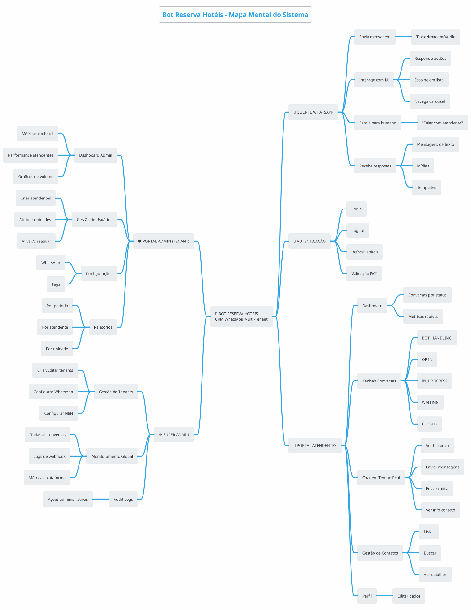
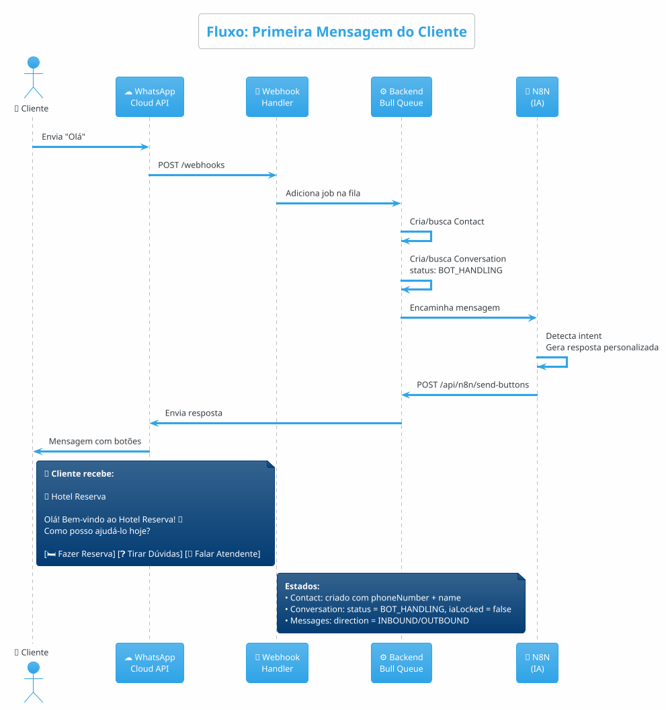
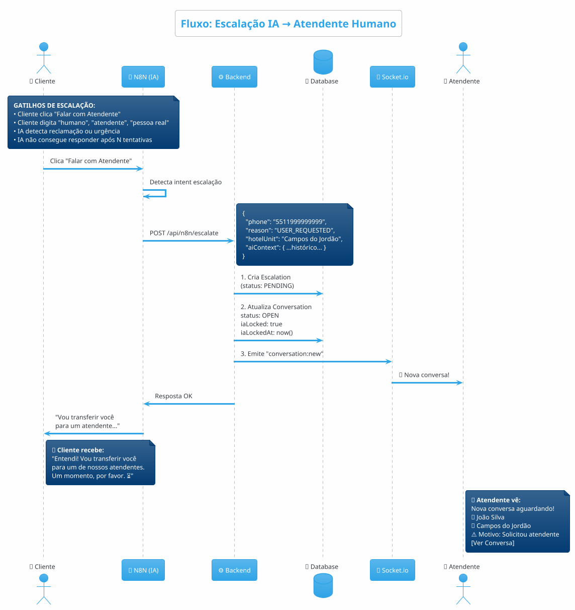

# Bot Reserva Hotéis - Fluxos de Usuário

> Versão: 1.0.0
> Data: Dezembro 2025

---

## 1. Mapa Mental do Sistema



---

## 2. Fluxos do CLIENTE (WhatsApp)

### 2.1 Fluxo de Primeira Mensagem



### 2.2 Fluxo de Navegação com IA (Carousel de Quartos)

```
┌─────────────────────────────────────────────────────────────────────────────────────────────────────────┐
│                                    FLUXO: NAVEGAÇÃO CAROUSEL DE QUARTOS                                  │
├─────────────────────────────────────────────────────────────────────────────────────────────────────────┤
│                                                                                                          │
│   ┌─────────────────┐                                                                                   │
│   │ Cliente clica   │                                                                                   │
│   │ "Fazer Reserva" │                                                                                   │
│   └────────┬────────┘                                                                                   │
│            │                                                                                             │
│            ▼                                                                                             │
│   ┌─────────────────┐      ┌─────────────────┐      ┌─────────────────────────────────────────────┐    │
│   │ Webhook recebe  │─────►│ N8N processa    │─────►│ Backend envia carousel                      │    │
│   │ button_reply    │      │ intent reserva  │      │ POST /api/n8n/send-carousel                 │    │
│   └─────────────────┘      └─────────────────┘      └─────────────────────────────────────────────┘    │
│                                                                                                          │
│   📱 CLIENTE VÊ CAROUSEL NO WHATSAPP:                                                                   │
│                                                                                                          │
│   ┌──────────────────────────────────────────────────────────────────────────────────────────────────┐  │
│   │                                                                                                   │  │
│   │   🏨 Hotel Reserva                                                                                │  │
│   │                                                                                                   │  │
│   │   Confira nossas opções de quartos:                                                              │  │
│   │                                                                                                   │  │
│   │   ┌─────────────────┐  ┌─────────────────┐  ┌─────────────────┐  ┌─────────────────┐            │  │
│   │   │ 📷              │  │ 📷              │  │ 📷              │  │ 📷              │            │  │
│   │   │ [Imagem Quarto] │  │ [Imagem Suite]  │  │ [Imagem Master] │  │ [Imagem Luxo]   │  ──►       │  │
│   │   │                 │  │                 │  │                 │  │                 │            │  │
│   │   │ Quarto Standard │  │ Suite Casal     │  │ Suite Master    │  │ Suite Luxo      │            │  │
│   │   │                 │  │                 │  │                 │  │                 │            │  │
│   │   │ [Ver Detalhes]  │  │ [Ver Detalhes]  │  │ [Ver Detalhes]  │  │ [Ver Detalhes]  │            │  │
│   │   │ [Voltar Menu]   │  │ [Voltar Menu]   │  │ [Voltar Menu]   │  │ [Voltar Menu]   │            │  │
│   │   └─────────────────┘  └─────────────────┘  └─────────────────┘  └─────────────────┘            │  │
│   │                                                                                                   │  │
│   │   ◄──────────────────────────── Deslize para ver mais ────────────────────────────►             │  │
│   │                                                                                                   │  │
│   └──────────────────────────────────────────────────────────────────────────────────────────────────┘  │
│                                                                                                          │
│   FLUXO APÓS CLIQUE "Ver Detalhes":                                                                    │
│                                                                                                          │
│   ┌─────────────────┐      ┌─────────────────┐      ┌─────────────────────────────────────────────┐    │
│   │ Webhook recebe  │─────►│ N8N identifica  │─────►│ Envia galeria de fotos do quarto            │    │
│   │ quick_reply     │      │ quarto escolhido│      │ + botão "Reservar Agora"                    │    │
│   └─────────────────┘      └─────────────────┘      └─────────────────────────────────────────────┘    │
│                                                                                                          │
└─────────────────────────────────────────────────────────────────────────────────────────────────────────┘
```

### 2.3 Fluxo de Escalação para Humano



---

## 3. Fluxos do ATENDENTE

### 3.1 Fluxo de Login

```
┌─────────────────────────────────────────────────────────────────────────────────────────────────────────┐
│                                    FLUXO: LOGIN DO ATENDENTE                                             │
├─────────────────────────────────────────────────────────────────────────────────────────────────────────┤
│                                                                                                          │
│   ┌─────────┐      ┌─────────────┐      ┌─────────────┐      ┌─────────────┐      ┌─────────────────┐  │
│   │ Acessa  │      │   Exibe     │      │   Usuário   │      │  Valida     │      │   Redireciona   │  │
│   │  Site   │─────►│   Login     │─────►│  Preenche   │─────►│  Backend    │─────►│   Dashboard     │  │
│   │         │      │   Page      │      │  Email/Senha│      │             │      │                 │  │
│   └─────────┘      └─────────────┘      └──────┬──────┘      └──────┬──────┘      └─────────────────┘  │
│                                                │                    │                                    │
│                                                │                    │                                    │
│                                         ┌──────▼──────┐      ┌──────▼──────┐                            │
│                                         │   Clica     │      │   Erro?     │                            │
│                                         │  "Entrar"   │      │             │                            │
│                                         └─────────────┘      └──────┬──────┘                            │
│                                                                     │                                    │
│                                                              ┌──────▼──────┐                            │
│                                                              │   Exibe     │                            │
│                                                              │   Toast     │                            │
│                                                              │   Erro      │                            │
│                                                              └─────────────┘                            │
│                                                                                                          │
│   RESPOSTA SUCESSO:                                                                                     │
│                                                                                                          │
│   {                                                                                                     │
│     "accessToken": "eyJhbGc...",    // JWT, expira em 8h                                               │
│     "refreshToken": "eyJhbGc...",   // JWT, expira em 7d                                               │
│     "user": {                                                                                           │
│       "id": "uuid",                                                                                     │
│       "name": "Maria Silva",                                                                            │
│       "email": "maria@hotel.com",                                                                       │
│       "role": "ATTENDANT",                                                                              │
│       "hotelUnit": "Campos do Jordão",                                                                  │
│       "tenantId": "tenant-uuid"                                                                         │
│     }                                                                                                   │
│   }                                                                                                     │
│                                                                                                          │
│   Estados:                                                                                              │
│   • Loading: Spinner no botão durante validação                                                         │
│   • Error: Toast vermelho "Email ou senha inválidos"                                                    │
│   • Success: Redirect para /dashboard + Toast verde "Bem-vindo(a)!"                                    │
│                                                                                                          │
└─────────────────────────────────────────────────────────────────────────────────────────────────────────┘
```

### 3.2 Fluxo de Dashboard (Kanban)

```
┌─────────────────────────────────────────────────────────────────────────────────────────────────────────┐
│                                    FLUXO: DASHBOARD KANBAN DE CONVERSAS                                  │
├─────────────────────────────────────────────────────────────────────────────────────────────────────────┤
│                                                                                                          │
│   ┌─────────────────────────────────────────────────────────────────────────────────────────────┐      │
│   │                              DASHBOARD - KANBAN DE CONVERSAS                                 │      │
│   │                                                                                              │      │
│   │  Filtros: [Todas Unidades ▼] [Todos Atendentes ▼] [Buscar contato...]                      │      │
│   │                                                                                              │      │
│   │  ┌───────────────┐  ┌───────────────┐  ┌───────────────┐  ┌───────────────┐                │      │
│   │  │   🟡 OPEN     │  │ 🔵 IN_PROGRESS│  │ 🟠 WAITING    │  │ 🟢 CLOSED     │                │      │
│   │  │   (5)         │  │   (3)         │  │   (2)         │  │   (47)        │                │      │
│   │  ├───────────────┤  ├───────────────┤  ├───────────────┤  ├───────────────┤                │      │
│   │  │               │  │               │  │               │  │               │                │      │
│   │  │ ┌───────────┐ │  │ ┌───────────┐ │  │ ┌───────────┐ │  │ ┌───────────┐ │                │      │
│   │  │ │ João Silva│ │  │ │ Ana Costa │ │  │ │ Pedro Luz │ │  │ │ Carlos M. │ │                │      │
│   │  │ │ 📍 C.Jordão│ │  │ │ 📍 Ilhabela│ │  │ │ 📍 Camburi│ │  │ │ 📍 C.Jordão│ │                │      │
│   │  │ │ 🔴 URGENT │ │  │ │ 🟡 MEDIUM │ │  │ │ 🟡 MEDIUM │ │  │ │ ✅ Fechado │ │                │      │
│   │  │ │ 🕐 2min   │ │  │ │ 👤 Maria  │ │  │ │ 👤 João   │ │  │ │ há 1h     │ │                │      │
│   │  │ │ (3) 💬    │ │  │ │ 🕐 15min  │ │  │ │ 🕐 1h     │ │  │ └───────────┘ │                │      │
│   │  │ └───────────┘ │  │ └───────────┘ │  │ └───────────┘ │  │               │                │      │
│   │  │               │  │               │  │               │  │ ┌───────────┐ │                │      │
│   │  │ ┌───────────┐ │  │ ┌───────────┐ │  │ ┌───────────┐ │  │ │ Lucia R.  │ │                │      │
│   │  │ │ Maria Luz │ │  │ │ Bruno M.  │ │  │ │ Carla S.  │ │  │ │ 📍 Ilhabela│ │                │      │
│   │  │ │ 📍 Ilhabela│ │  │ │ 📍 C.Jordão│ │  │ 📍 Ilhabela │ │  │ │ ✅ Fechado │ │                │      │
│   │  │ │ 🟡 HIGH   │ │  │ │ 👤 Pedro  │ │  │ └───────────┘ │  │ │ há 2h     │ │                │      │
│   │  │ │ 🕐 5min   │ │  │ │ 🕐 30min  │ │  │               │  │ └───────────┘ │                │      │
│   │  │ │ (1) 💬    │ │  │ └───────────┘ │  │               │  │               │                │      │
│   │  │ └───────────┘ │  │               │  │               │  │      ...      │                │      │
│   │  │               │  │ ┌───────────┐ │  │               │  │               │                │      │
│   │  │      ...      │  │ │ Sofia P.  │ │  │               │  │               │                │      │
│   │  │               │  │ │ 👤 Ana    │ │  │               │  │               │                │      │
│   │  │               │  │ └───────────┘ │  │               │  │               │                │      │
│   │  │               │  │               │  │               │  │               │                │      │
│   │  └───────────────┘  └───────────────┘  └───────────────┘  └───────────────┘                │      │
│   │                                                                                              │      │
│   └─────────────────────────────────────────────────────────────────────────────────────────────┘      │
│                                                                                                          │
│   LEGENDA CARD:                                                                                         │
│   • Nome do contato                                                                                     │
│   • 📍 Unidade hoteleira                                                                                │
│   • 🔴🟡🟢 Prioridade (URGENT/HIGH/MEDIUM/LOW)                                                          │
│   • 👤 Atendente atribuído (se houver)                                                                  │
│   • 🕐 Tempo desde última mensagem                                                                      │
│   • (N) 💬 Mensagens não lidas                                                                          │
│                                                                                                          │
│   INTERAÇÕES:                                                                                           │
│   • Drag & Drop: arrastar card entre colunas muda status                                               │
│   • Click: abre chat da conversa                                                                        │
│   • Double-click: atribui a mim (se não atribuído)                                                      │
│   • Filtros: atualizam lista em tempo real                                                              │
│   • Socket.io: novos cards aparecem automaticamente                                                     │
│                                                                                                          │
└─────────────────────────────────────────────────────────────────────────────────────────────────────────┘
```

### 3.3 Fluxo de Chat em Tempo Real

```
┌─────────────────────────────────────────────────────────────────────────────────────────────────────────┐
│                                    FLUXO: CHAT EM TEMPO REAL COM CLIENTE                                 │
├─────────────────────────────────────────────────────────────────────────────────────────────────────────┤
│                                                                                                          │
│   ┌─────────────────────────────────────────────────────────────────────────────────────────────┐      │
│   │                                  TELA DE CHAT                                                │      │
│   │                                                                                              │      │
│   │  ┌──────────────────────────────────────────┬───────────────────────────────────────────┐   │      │
│   │  │                                          │                                           │   │      │
│   │  │  CONVERSA                                │  INFO DO CONTATO                          │   │      │
│   │  │                                          │                                           │   │      │
│   │  │  ┌────────────────────────────────────┐  │  👤 João da Silva                        │   │      │
│   │  │  │ ◄ Voltar                           │  │  📱 +55 11 99999-9999                    │   │      │
│   │  │  │ João da Silva        🔴 URGENT    │  │  📧 joao@email.com                       │   │      │
│   │  │  │ 📍 Campos do Jordão               │  │                                           │   │      │
│   │  │  └────────────────────────────────────┘  │  ─────────────────────────                │   │      │
│   │  │                                          │                                           │   │      │
│   │  │  ┌────────────────────────────────────┐  │  TAGS                                    │   │      │
│   │  │  │                                    │  │  [Reserva] [VIP]                         │   │      │
│   │  │  │  10:30 - Cliente                   │  │                                           │   │      │
│   │  │  │  ┌─────────────────────────────┐   │  │  ─────────────────────────                │   │      │
│   │  │  │  │ Olá, quero fazer uma       │   │  │                                           │   │      │
│   │  │  │  │ reserva para o fim de      │   │  │  AÇÕES                                    │   │      │
│   │  │  │  │ semana que vem.            │   │  │                                           │   │      │
│   │  │  │  └─────────────────────────────┘   │  │  Status: [Em Andamento ▼]                │   │      │
│   │  │  │                                    │  │  Prioridade: [🔴 Urgente ▼]              │   │      │
│   │  │  │  10:31 - Bot                       │  │  Atribuído: [Maria ▼]                    │   │      │
│   │  │  │  ┌─────────────────────────────┐   │  │                                           │   │      │
│   │  │  │  │ Olá! Entendi que você      │   │  │  [Transferir Conversa]                   │   │      │
│   │  │  │  │ deseja fazer uma reserva.  │   │  │  [Fechar Conversa]                       │   │      │
│   │  │  │  │ Vou te transferir para...  │   │  │                                           │   │      │
│   │  │  │  └─────────────────────────────┘   │  │  ─────────────────────────                │   │      │
│   │  │  │                                    │  │                                           │   │      │
│   │  │  │  10:35 - Eu (Maria)               │  │  HISTÓRICO                                │   │      │
│   │  │  │  ┌─────────────────────────────┐   │  │  • 3 conversas anteriores               │   │      │
│   │  │  │  │ Olá João! Sou a Maria,     │   │  │  • Última: 15/12/2024                    │   │      │
│   │  │  │  │ vou te ajudar. Para qual   │   │  │  • Total mensagens: 47                   │   │      │
│   │  │  │  │ data você deseja?          │   │  │                                           │   │      │
│   │  │  │  └─────────────────────────────┘   │  │  [Ver Histórico Completo]               │   │      │
│   │  │  │                      ✓✓ Lida       │  │                                           │   │      │
│   │  │  │                                    │  │                                           │   │      │
│   │  │  └────────────────────────────────────┘  │                                           │   │      │
│   │  │                                          │                                           │   │      │
│   │  │  ┌────────────────────────────────────┐  │                                           │   │      │
│   │  │  │ [Digite sua mensagem...        ]  │  │                                           │   │      │
│   │  │  │                                    │  │                                           │   │      │
│   │  │  │ 📎 📷 🎤             [Enviar ►]   │  │                                           │   │      │
│   │  │  └────────────────────────────────────┘  │                                           │   │      │
│   │  │                                          │                                           │   │      │
│   │  └──────────────────────────────────────────┴───────────────────────────────────────────┘   │      │
│   │                                                                                              │      │
│   └─────────────────────────────────────────────────────────────────────────────────────────────┘      │
│                                                                                                          │
│   FLUXO ENVIAR MENSAGEM:                                                                                │
│                                                                                                          │
│   ┌─────────────┐     ┌─────────────┐     ┌─────────────┐     ┌─────────────┐     ┌─────────────┐     │
│   │ Digita      │────►│ Clica       │────►│ POST API    │────►│ WhatsApp    │────►│ Atualiza    │     │
│   │ mensagem    │     │ Enviar      │     │ /messages   │     │ Cloud API   │     │ UI local    │     │
│   │             │     │             │     │             │     │ envia       │     │ + Socket.io │     │
│   └─────────────┘     └─────────────┘     └──────┬──────┘     └─────────────┘     └─────────────┘     │
│                                                  │                                                      │
│                                           ┌──────▼──────┐                                              │
│                                           │ Status msg: │                                              │
│                                           │ ✓ Enviada   │                                              │
│                                           │ ✓✓ Entregue │                                              │
│                                           │ ✓✓ Lida     │                                              │
│                                           └─────────────┘                                              │
│                                                                                                          │
└─────────────────────────────────────────────────────────────────────────────────────────────────────────┘
```

### 3.4 Fluxo de Assumir Conversa

```
┌─────────────────────────────────────────────────────────────────────────────────────────────────────────┐
│                                    FLUXO: ASSUMIR CONVERSA                                               │
├─────────────────────────────────────────────────────────────────────────────────────────────────────────┤
│                                                                                                          │
│   ┌─────────────────┐                                                                                   │
│   │ Kanban: Coluna  │                                                                                   │
│   │ "OPEN"          │                                                                                   │
│   └────────┬────────┘                                                                                   │
│            │                                                                                             │
│            ▼                                                                                             │
│   ┌─────────────────────────────────────────────────────────────────────────────────────────────┐      │
│   │                              CARD DE CONVERSA NÃO ATRIBUÍDA                                  │      │
│   │                                                                                              │      │
│   │  ┌─────────────────────────────────────────────────────────────────────────────────────┐   │      │
│   │  │ João Silva                                                        🔴 URGENT         │   │      │
│   │  │ 📍 Campos do Jordão                                                                 │   │      │
│   │  │ 🕐 5 min atrás                                                   (3) 💬 não lidas  │   │      │
│   │  │                                                                                      │   │      │
│   │  │ Última msg: "Preciso de ajuda urgente com minha reserva"                            │   │      │
│   │  │                                                                                      │   │      │
│   │  │                                            [Assumir] [Ver]                          │   │      │
│   │  └─────────────────────────────────────────────────────────────────────────────────────┘   │      │
│   │                                                                                              │      │
│   └─────────────────────────────────────────────────────────────────────────────────────────────┘      │
│                                                                                                          │
│   CLICA "ASSUMIR":                                                                                      │
│                                                                                                          │
│   ┌───────────────┐     ┌───────────────┐     ┌───────────────┐     ┌───────────────────────┐          │
│   │ Modal de      │────►│ Confirma      │────►│ PATCH API     │────►│ Atualiza UI           │          │
│   │ confirmação   │     │ "Sim"         │     │ /conversations│     │ + Socket.io broadcast │          │
│   │               │     │               │     │ /:id/assign   │     │                       │          │
│   └───────────────┘     └───────────────┘     └───────────────┘     └───────────────────────┘          │
│                                                                                                          │
│   RESULTADO:                                                                                            │
│   • Conversation.assignedToId = userId                                                                  │
│   • Conversation.status = IN_PROGRESS                                                                   │
│   • Card move para coluna "IN_PROGRESS"                                                                 │
│   • Badge "👤 Maria" aparece no card                                                                    │
│   • Escalation.status = IN_PROGRESS (se veio de escalação)                                             │
│   • Toast: "Conversa atribuída a você"                                                                  │
│   • Outros atendentes veem atualização via Socket.io                                                    │
│                                                                                                          │
└─────────────────────────────────────────────────────────────────────────────────────────────────────────┘
```

### 3.5 Fluxo de Mudar Status

```
┌─────────────────────────────────────────────────────────────────────────────────────────────────────────┐
│                                    FLUXO: MUDAR STATUS DA CONVERSA                                       │
├─────────────────────────────────────────────────────────────────────────────────────────────────────────┤
│                                                                                                          │
│   MÁQUINA DE ESTADOS:                                                                                   │
│                                                                                                          │
│   ┌─────────────────────────────────────────────────────────────────────────────────────────────────┐  │
│   │                                                                                                  │  │
│   │     ┌───────────────┐                                                                           │  │
│   │     │ BOT_HANDLING  │ ◄─── IA está atendendo (não aparece no Kanban)                           │  │
│   │     └───────┬───────┘                                                                           │  │
│   │             │ (escalação)                                                                        │  │
│   │             ▼                                                                                    │  │
│   │     ┌───────────────┐                                                                           │  │
│   │     │     OPEN      │ ◄─── Aguardando atendente assumir                                        │  │
│   │     └───────┬───────┘                                                                           │  │
│   │             │ (assumir)                                                                          │  │
│   │             ▼                                                                                    │  │
│   │     ┌───────────────┐         ┌───────────────┐                                                │  │
│   │     │  IN_PROGRESS  │◄───────►│   WAITING     │ ◄─── Aguardando resposta do cliente           │  │
│   │     └───────┬───────┘         └───────────────┘                                                │  │
│   │             │                                                                                    ��  │
│   │             │ (resolver/fechar)                                                                  │  │
│   │             ▼                                                                                    │  │
│   │     ┌───────────────┐                                                                           │  │
│   │     │    CLOSED     │ ◄─── Conversa finalizada (estado final)                                  │  │
│   │     └───────────────┘                                                                           │  │
│   │                                                                                                  │  │
│   │   Nota: CLOSED pode voltar para OPEN se cliente enviar nova mensagem                            │  │
│   │                                                                                                  │  │
│   └─────────────────────────────────────────────────────────────────────────────────────────────────┘  │
│                                                                                                          │
│   DROPDOWN NO CHAT:                                                                                     │
│                                                                                                          │
│   ┌───────────────────────────────────────────────────────────────────┐                                │
│   │                     Alterar Status                                │                                │
│   │                                                                   │                                │
│   │   Status atual: 🔵 Em Andamento                                  │                                │
│   │                                                                   │                                │
│   │   ┌─────────────────────────────────────────────────────────┐    │                                │
│   │   │ 🟠 Aguardando Cliente                                   │    │                                │
│   │   │    Esperando resposta/informação do cliente             │    │                                │
│   │   ├─────────────────────────────────────────────────────────┤    │                                │
│   │   │ ✅ Fechar Conversa                                      │    │                                │
│   │   │    Encerrar atendimento                                 │    │                                │
│   │   └─────────────────────────────────────────────────────────┘    │                                │
│   │                                                                   │                                │
│   └───────────────────────────────────────────────────────────────────┘                                │
│                                                                                                          │
└─────────────────────────────────────────────────────────────────────────────────────────────────────────┘
```

---

## 4. Fluxos do ADMIN (Tenant)

### 4.1 Fluxo de Dashboard Admin

```
┌─────────────────────────────────────────────────────────────────────────────────────────────────────────┐
│                                    FLUXO: DASHBOARD ADMIN DO HOTEL                                       │
├─────────────────────────────────────────────────────────────────────────────────────────────────────────┤
│                                                                                                          │
│   ┌─────────────────────────────────────────────────────────────────────────────────────────────┐      │
│   │                              DASHBOARD ADMIN                                                 │      │
│   │                                                                                              │      │
│   │  ┌─────────────────────────────────────────────────────────────────────────────────────┐   │      │
│   │  │                              MÉTRICAS CARDS                                          │   │      │
│   │  │  ┌────────────┐  ┌────────────┐  ┌────────────┐  ┌────────────┐                    │   │      │
│   │  │  │     12     │  │      8     │  │    156     │  │   15min    │                    │   │      │
│   │  │  │ Aguardando │  │ Em Atend.  │  │ Este mês   │  │ T. Médio   │                    │   │      │
│   │  │  │  ▲ 3 hoje  │  │            │  │  ▲ 24%     │  │ Resposta   │                    │   │      │
│   │  │  └────────────┘  └────────────┘  └────────────┘  └────────────┘                    │   │      │
│   │  └─────────────────────────────────────────────────────────────────────────────────────┘   │      │
│   │                                                                                              │      │
│   │  ┌────────────────────────────────────────┬────────────────────────────────────────────┐   │      │
│   │  │        CONVERSAS POR UNIDADE           │         PERFORMANCE ATENDENTES             │   │      │
│   │  │                                        │                                             │   │      │
│   │  │     Campos do Jordão ████████ 45      │    Maria Silva       ████████ 32 atend.   │   │      │
│   │  │     Ilhabela         ██████   28      │    João Santos       ██████   24 atend.   │   │      │
│   │  │     Camburi          ████     18      │    Ana Costa         ████     15 atend.   │   │      │
│   │  │     Sto Antônio      ██       12      │    Pedro Lima        ███      12 atend.   │   │      │
│   │  │                                        │                                             │   │      │
│   │  └────────────────────────────────────────┴────────────────────────────────────────────┘   │      │
│   │                                                                                              │      │
│   │  ┌────────────────────────────────────────┬────────────────────────────────────────────┐   │      │
│   │  │      VOLUME POR HORA (HOJE)            │        CONVERSAS URGENTES                  │   │      │
│   │  │                                        │                                             │   │      │
│   │  │           ▃▅▇█▆▄▂▁                     │  🔴 João Silva - Campos do Jordão         │   │      │
│   │  │     08 10 12 14 16 18 20 22           │     "Problema com reserva" - há 5min      │   │      │
│   │  │                                        │     [Ver]                                  │   │      │
│   │  │     Pico: 14h (32 mensagens)          │                                             │   │      │
│   │  │                                        │  🔴 Maria Luz - Ilhabela                  │   │      │
│   │  │                                        │     "Reclamação" - há 10min               │   │      │
│   │  │                                        │     [Ver]                                  │   │      │
│   │  └────────────────────────────────────────┴────────────────────────────────────────────┘   │      │
│   │                                                                                              │      │
│   └─────────────────────────────────────────────────────────────────────────────────────────────┘      │
│                                                                                                          │
│   INTERAÇÕES:                                                                                           │
│   • Cards: clicáveis, filtram lista de conversas                                                        │
│   • Gráficos: hover mostra detalhes                                                                     │
│   • Conversas urgentes: clique abre chat                                                                │
│   • Auto-refresh: a cada 30 segundos                                                                    │
│                                                                                                          │
└─────────────────────────────────────────────────────────────────────────────────────────────────────────┘
```

### 4.2 Fluxo de Gerenciar Atendentes

```
┌─────────────────────────────────────────────────────────────────────────────────────────────────────────┐
│                                    FLUXO: GERENCIAR ATENDENTES                                           │
├─────────────────────────────────────────────────────────────────────────────────────────────────────────┤
│                                                                                                          │
│   ┌─────────────────────────────────────────────────────────────────────────────────────────────┐      │
│   │                              PÁGINA USUÁRIOS                                                 │      │
│   │                                                                                              │      │
│   │  ┌──────────────────────────────────────────────────────────────────────────────────────┐  │      │
│   │  │  Usuários                                                    [+ Novo Usuário]         │  │      │
│   │  ├──────────────────────────────────────────────────────────────────────────────────────┤  │      │
│   │  │                                                                                       │  │      │
│   │  │  Filtros: [Todos Roles ▼] [Todas Unidades ▼] [Status ▼] [Buscar...]                 │  │      │
│   │  │                                                                                       │  │      │
│   │  │  ┌─────┬──────────────────┬───────────────────┬─────────────┬──────────┬──────────┐ │  │      │
│   │  │  │ 👤  │ Nome             │ Email             │ Unidade     │ Role     │ Ações    │ │  │      │
│   │  │  ├─────┼──────────────────┼───────────────────┼─────────────┼──────────┼──────────┤ │  │      │
│   │  │  │ MS  │ Maria Silva      │ maria@hotel.com   │ C. Jordão   │ Atendente│ ✏️ 🗑️    │ │  │      │
│   │  │  │ JS  │ João Santos      │ joao@hotel.com    │ Ilhabela    │ Atendente│ ✏️ 🗑️    │ │  │      │
│   │  │  │ AC  │ Ana Costa        │ ana@hotel.com     │ Camburi     │ Atendente│ ✏️ 🗑️    │ │  │      │
│   │  │  │ PL  │ Pedro Lima       │ pedro@hotel.com   │ Sto Antônio │ Atendente│ ✏️ 🗑️    │ │  │      │
│   │  │  │ AD  │ Admin Hotel      │ admin@hotel.com   │ Todas       │ Admin    │ ✏️       │ │  │      │
│   │  │  └─────┴──────────────────┴───────────────────┴─────────────┴──────────┴──────────┘ │  │      │
│   │  │                                                                                       │  │      │
│   │  └──────────────────────────────────────────────────────────────────────────────────────┘  │      │
│   │                                                                                              │      │
│   └─────────────────────────────────────────────────────────────────────────────────────────────┘      │
│                                                                                                          │
│   MODAL CRIAR/EDITAR USUÁRIO:                                                                           │
│                                                                                                          │
│   ┌───────────────────────────────────────────────────────────────────┐                                │
│   │                     Novo Usuário                         [X]      │                                │
│   │                                                                   │                                │
│   │   Nome *          [________________________]                      │                                │
│   │   Email *         [________________________]                      │                                │
│   │   Senha *         [________________________]                      │                                │
│   │   Role            [▼ Atendente ]                                  │                                │
│   │                   • Atendente - atende conversas                  │                                │
│   │                   • Admin - gerencia equipe                       │                                │
│   │   Unidade         [▼ Campos do Jordão ]                           │                                │
│   │                   • Campos do Jordão                              │                                │
│   │                   • Ilhabela                                      │                                │
│   │                   • Camburi                                       │                                │
│   │                   • Santo Antônio do Pinhal                       │                                │
│   │                                                                   │                                │
│   │                           [Cancelar] [Salvar]                     │                                │
│   └───────────────────────────────────────────────────────────────────┘                                │
│                                                                                                          │
│   REGRAS:                                                                                               │
│   • Atendente só vê conversas da sua unidade                                                            │
│   • Admin vê todas as unidades                                                                          │
│   • Não pode deletar último admin                                                                       │
│   • Email deve ser único no sistema                                                                     │
│                                                                                                          │
└─────────────────────────────────────────────────────────────────────────────────────────────────────────┘
```

### 4.3 Fluxo de Configurar WhatsApp

```
┌─────────────────────────────────────────────────────────────────────────────────────────────────────────┐
│                                    FLUXO: CONFIGURAR WHATSAPP                                            │
├─────────────────────────────────────────────────────────────────────────────────────────────────────────┤
│                                                                                                          │
│   ┌─────────────────────────────────────────────────────────────────────────────────────────────┐      │
│   │                              CONFIGURAÇÕES WHATSAPP                                          │      │
│   │                                                                                              │      │
│   │  ┌──────────────────────────────────────────────────────────────────────────────────────┐  │      │
│   │  │                                                                                       │  │      │
│   │  │  Status da Conexão:  🟢 Conectado                                                    │  │      │
│   │  │  Número: +55 11 99999-9999                                                           │  │      │
│   │  │                                                                                       │  │      │
│   │  │  ─────────────────────────────────────────────────────────────────────────────────── │  │      │
│   │  │                                                                                       │  │      │
│   │  │  Phone Number ID *                                                                    │  │      │
│   │  │  [123456789012345                                         ]                          │  │      │
│   │  │  ID do número no Meta Business                                                        │  │      │
│   │  │                                                                                       │  │      │
│   │  │  Business Account ID *                                                                │  │      │
│   │  │  [987654321098765                                         ]                          │  │      │
│   │  │  ID da conta Business no Meta                                                         │  │      │
│   │  │                                                                                       │  │      │
│   │  │  Access Token *                                                                       │  │      │
│   │  │  [EAAx...                                                 ] 👁️                       │  │      │
│   │  │  Token permanente da API do WhatsApp                                                  │  │      │
│   │  │                                                                                       │  │      │
│   │  │  App Secret                                                                           │  │      │
│   │  │  [••••••••••••••••                                        ] 👁️                       │  │      │
│   │  │  Para validação de webhooks (opcional mas recomendado)                                │  │      │
│   │  │                                                                                       │  │      │
│   │  │  Webhook Verify Token                                                                 │  │      │
│   │  │  [meu_token_secreto_123                                   ]                          │  │      │
│   │  │  Token de verificação para setup do webhook no Meta                                   │  │      │
│   │  │                                                                                       │  │      │
│   │  │                                                    [Testar Conexão] [Salvar]         │  │      │
│   │  │                                                                                       │  │      │
│   │  └──────────────────────────────────────────────────────────────────────────────────────┘  │      │
│   │                                                                                              │      │
│   │  ┌──────────────────────────────────────────────────────────────────────────────────────┐  │      │
│   │  │  WEBHOOK URL (configurar no Meta for Developers):                                     │  │      │
│   │  │                                                                                       │  │      │
│   │  │  https://api.botreserva.com.br/webhooks/whatsapp            [📋 Copiar]              │  │      │
│   │  │                                                                                       │  │      │
│   │  └──────────────────────────────────────────────────────────────────────────────────────┘  │      │
│   │                                                                                              │      │
│   └─────────────────────────────────────────────────────────────────────────────────────────────┘      │
│                                                                                                          │
│   FLUXO "TESTAR CONEXÃO":                                                                               │
│                                                                                                          │
│   ┌─────────────┐     ┌─────────────┐     ┌─────────────┐     ┌─────────────────────────────────┐     │
│   │ Clica       │────►│ Backend     │────►│ WhatsApp    │────►│ Resultado                       │     │
│   │ "Testar"    │     │ valida      │     │ Cloud API   │     │ 🟢 Sucesso: "Conexão OK"       │     │
│   │             │     │ credenciais │     │ GET /me     │     │ 🔴 Erro: "Token inválido"      │     │
│   └─────────────┘     └─────────────┘     └─────────────┘     └─────────────────────────────────┘     │
│                                                                                                          │
└─────────────────────────────────────────────────────────────────────────────────────────────────────────┘
```

---

## 5. Estados de Interface

### 5.1 Loading States

```
┌─────────────────────────────────────────────────────────────────────────────────────────────────────────┐
│                                    ESTADOS DE LOADING                                                    │
├─────────────────────────────────────────────────────────────────────────────────────────────────────────┤
│                                                                                                          │
│   SKELETON (Carregamento inicial de página):                                                            │
│                                                                                                          │
│   ┌─────────────────────────────────────────────────────────────────────────────────────┐              │
│   │                                                                                      │              │
│   │   ░░░░░░░░░░░░░░░░░░░░░░░░░░░░░░░░░░░░░░░░░░░░░░░░░░░░░░░░░░░░░░                  │              │
│   │   ░░░░░░░░░░░░░░░░░░░░                                                             │              │
│   │                                                                                      │              │
│   │   ┌──────────────┐  ┌──────────────┐  ┌──────────────┐  ┌──────────────┐          │              │
│   │   │░░░░░░░░░░░░░░│  │░░░░░░░░░░░░░░│  │░░░░░░░░░░░░░░│  │░░░░░░░░░░░░░░│          │              │
│   │   │░░░░░░░░░░░░░░│  │░░░░░░░░░░░░░░│  │░░░░░░░░░░░░░░│  │░░░░░░░░░░░░░░│          │              │
│   │   └──────────────┘  └──────────────┘  └──────────────┘  └──────────────┘          │              │
│   │                                                                                      │              │
│   └─────────────────────────────────────────────────────────────────────────────────────┘              │
│                                                                                                          │
│   BUTTON LOADING (Ação em progresso):                                                                   │
│                                                                                                          │
│   [  ⟳ Enviando...  ]  (spinner + texto, botão desabilitado)                                           │
│                                                                                                          │
│   CHAT LOADING (Carregando mensagens):                                                                  │
│                                                                                                          │
│   ┌─────────────────────────────────────────────────────────────────────────────────────┐              │
│   │                                                                                      │              │
│   │                              ⟳ Carregando mensagens...                              │              │
│   │                                                                                      │              │
│   └─────────────────────────────────────────────────────────────────────────────────────┘              │
│                                                                                                          │
└─────────────────────────────────────────────────────────────────────────────────────────────────────────┘
```

### 5.2 Empty States

```
┌─────────────────────────────────────────────────────────────────────────────────────────────────────────┐
│                                    ESTADOS VAZIOS                                                        │
├─────────────────────────────────────────────────────────────────────────────────────────────────────────┤
│                                                                                                          │
│   KANBAN VAZIO (Nenhuma conversa):                                                                      │
│                                                                                                          │
│   ┌─────────────────────────────────────────────────────────────────────────────────────┐              │
│   │                                                                                      │              │
│   │                               💬                                                     │              │
│   │                                                                                      │              │
│   │                     Nenhuma conversa encontrada                                      │              │
│   │                                                                                      │              │
│   │           Quando clientes enviarem mensagens via WhatsApp,                          │              │
│   │           as conversas aparecerão aqui.                                             │              │
│   │                                                                                      │              │
│   │                        [Verificar Configuração WhatsApp]                            │              │
│   │                                                                                      │              │
│   └─────────────────────────────────────────────────────────────────────────────────────┘              │
│                                                                                                          │
│   BUSCA SEM RESULTADOS:                                                                                 │
│                                                                                                          │
│   ┌─────────────────────────────────────────────────────────────────────────────────────┐              │
│   │                                                                                      │              │
│   │                               🔍                                                     │              │
│   │                                                                                      │              │
│   │                     Nenhum contato encontrado                                        │              │
│   │                                                                                      │              │
│   │           Não encontramos contatos com "João Silva".                                │              │
│   │           Tente outro termo de busca.                                               │              │
│   │                                                                                      │              │
│   │                            [Limpar Busca]                                           │              │
│   │                                                                                      │              │
│   └─────────────────────────────────────────────────────────────────────────────────────┘              │
│                                                                                                          │
└─────────────────────────────────────────────────────────────────────────────────────────────────────────┘
```

### 5.3 Error States

```
┌─────────────────────────────────────────────────────────────────────────────────────────────────────────┐
│                                    ESTADOS DE ERRO                                                       │
├─────────────────────────────────────────────────────────────────────────────────────────────────────────┤
│                                                                                                          │
│   ERRO DE CONEXÃO:                                                                                      │
│                                                                                                          │
│   ┌─────────────────────────────────────────────────────────────────────────────────────┐              │
│   │                                                                                      │              │
│   │                               📡                                                     │              │
│   │                                                                                      │              │
│   │                       Erro de conexão                                               │              │
│   │                                                                                      │              │
│   │           Não foi possível conectar ao servidor.                                    │              │
│   │           Verifique sua conexão com a internet.                                     │              │
│   │                                                                                      │              │
│   │                          [Tentar Novamente]                                         │              │
│   │                                                                                      │              │
│   └─────────────────────────────────────────────────────────────────────────────────────┘              │
│                                                                                                          │
│   TOAST ERRO:                                                                                           │
│                                                                                                          │
│   ┌───────────────────────────────────────────────────────┐                                            │
│   │  ❌  Erro ao enviar mensagem. Tente novamente.    [X] │                                            │
│   └───────────────────────────────────────────────────────┘                                            │
│                                                                                                          │
│   FORM ERROR (Validação):                                                                               │
│                                                                                                          │
│   Email *  [___________________________]                                                                │
│            ⚠️ Email inválido                                                                            │
│                                                                                                          │
└─────────────────────────────────────────────────────────────────────────────────────────────────────────┘
```

---

## 6. Matriz de Permissões por Fluxo

| Fluxo | ATTENDANT | TENANT_ADMIN | SUPER_ADMIN |
|-------|-----------|--------------|-------------|
| Ver conversas da própria unidade | ✅ | ✅ | ✅ |
| Ver todas conversas do tenant | ❌ | ✅ | ✅ |
| Ver conversas de outros tenants | ❌ | ❌ | ✅ |
| Assumir conversa | ✅ | ✅ | ✅ |
| Enviar mensagem | ✅ | ✅ | ✅ |
| Mudar status conversa | ✅ | ✅ | ✅ |
| Transferir conversa | ✅ | ✅ | ✅ |
| Ver dashboard básico | ✅ | ✅ | ✅ |
| Ver dashboard admin | ❌ | ✅ | ✅ |
| Gerenciar usuários | ❌ | ✅ | ✅ |
| Gerenciar tags | ❌ | ✅ | ✅ |
| Configurar WhatsApp | ❌ | ✅ | ✅ |
| Ver relatórios | ❌ | ✅ | ✅ |
| Gerenciar tenants | ❌ | ❌ | ✅ |
| Ver logs de webhook | ❌ | ❌ | ✅ |
| Ver audit logs | ❌ | ❌ | ✅ |

---

Última atualização: Dezembro de 2025

**Desenvolvido por [3ian](https://3ian.com.br)** - Soluções em Tecnologia e Automação
