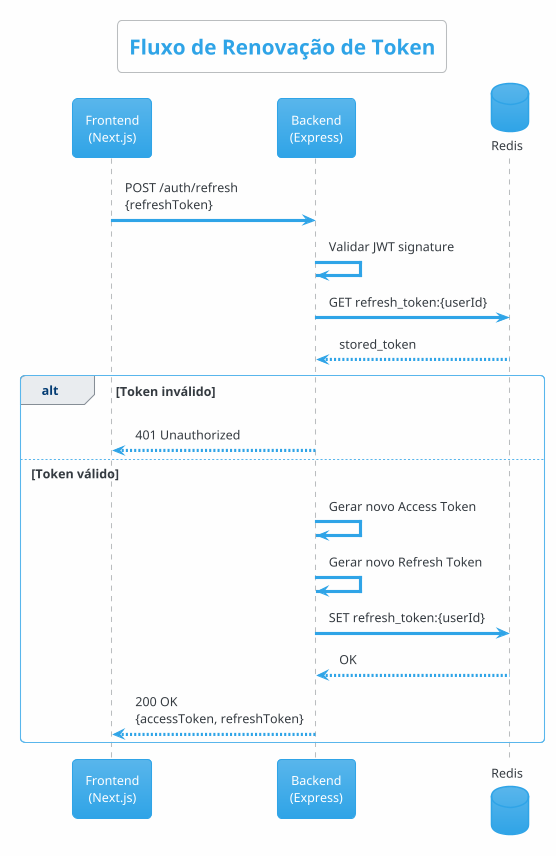

# Diagramas de Sequência - Bot Reserva Hotéis

## 1. Fluxo de Autenticação

### 1.1 Login com Geração de JWT

```plantuml
@startuml Login JWT
!theme blueprint
skinparam backgroundColor #FAFBFC
skinparam shadowing false
skinparam defaultFontName "SF Pro Display", "Helvetica Neue", Arial
skinparam roundcorner 10
skinparam sequenceMessageAlign center
skinparam maxMessageSize 200

skinparam participant {
    BackgroundColor gradient(#DBEAFE, #BFDBFE)
    BorderColor #3B82F6
    FontColor #1E40AF
    BorderThickness 2
    Padding 15
}

skinparam database {
    BackgroundColor gradient(#FEF3C7, #FDE68A)
    BorderColor #F59E0B
    FontColor #92400E
    BorderThickness 2
}

skinparam sequence {
    ArrowColor #3B82F6
    ArrowThickness 2
    LifeLineBorderColor #64748B
    LifeLineBackgroundColor #F1F5F9

    BoxBorderColor #3B82F6
    BoxBackgroundColor gradient(#EFF6FF, #DBEAFE)
    BoxFontColor #1E40AF

    DividerBackgroundColor gradient(#10B981, #059669)
    DividerBorderColor #047857
    DividerFontColor #FFFFFF
    DividerBorderThickness 2
}

skinparam note {
    BackgroundColor #FEF3C7
    BorderColor #F59E0B
    FontColor #92400E
}

title\n<size:24><b>Authentication Flow</b></size>\n<size:14>JWT Token Generation - Login Process</size>\n

participant "<size:14><b>Frontend</b></size>\n<size:10>Next.js App</size>" as frontend #60A5FA
participant "<size:14><b>Backend API</b></size>\n<size:10>Express.js</size>" as backend #3B82F6
database "<size:14><b>PostgreSQL</b></size>\n<size:10>User Store</size>" as db #F59E0B
database "<size:14><b>Redis</b></size>\n<size:10>Token Cache</size>" as redis #EF4444

== User Login Request ==

frontend -[#3B82F6]> backend : <b>POST /auth/login</b>\n<size:10>{email, password}</size>
activate backend #E0F2FE

backend -> backend : <b>Validate Request</b>\n<size:9>Zod Schema</size>
activate backend #BFDBFE

note right of backend #FEF3C7
  <b>Validation Rules:</b>
  • Email format (RFC 5322)
  • Password min 8 chars
  • Rate limit check
end note

backend -[#F59E0B]> db : <b>SELECT * FROM users</b>\n<size:10>WHERE email = ?</size>
activate db #FEF3C7

db --[#F59E0B]> backend : <size:11><b>user data</b></size>\n<size:9>{id, email, password_hash,\ntenantId, role}</size>
deactivate db

deactivate backend

backend -> backend : <b>Verify Password</b>\n<size:9>bcrypt.compare(password, hash)</size>
activate backend #BFDBFE

alt <size:13><b>❌ Invalid Credentials</b></size>
    backend --[#EF4444]x frontend : <b>401 Unauthorized</b>\n<size:10>{error: "Credenciais inválidas"}</size>

    note left of frontend #FEE2E2
      <b>Error Handling:</b>
      • Show error message
      • Clear form
      • Log attempt (security)
    end note

else <size:13><b>✅ Valid Credentials</b></size>

    deactivate backend

    backend -> backend : <b>Generate Access Token</b>\n<size:9>JWT • exp: 8h • HS256</size>
    activate backend #A7F3D0

    note right of backend #D1FAE5
      <b>Access Token Payload:</b>
      {
        sub: userId,
        tenantId: tenantId,
        role: 'ATTENDANT',
        iat: timestamp,
        exp: timestamp + 8h
      }
    end note

    backend -> backend : <b>Generate Refresh Token</b>\n<size:9>JWT • exp: 7d • HS256</size>

    note right of backend #D1FAE5
      <b>Refresh Token Payload:</b>
      {
        sub: userId,
        type: 'refresh',
        iat: timestamp,
        exp: timestamp + 7d
      }
    end note

    deactivate backend

    backend -[#EF4444]> redis : <b>SET refresh_token:{userId}</b>\n<size:10>value: refreshToken</size>\n<size:10>ttl: 7 days</size>
    activate redis #FEE2E2

    redis --[#EF4444]> backend : <b>OK</b>
    deactivate redis

    backend --[#10B981]> frontend : <b>200 OK</b>\n<size:10>{accessToken, refreshToken, user}</size>

    note left of frontend #D1FAE5
      <b>Client Storage:</b>
      • localStorage.setItem('access_token')
      • httpOnly cookie (refresh_token)
      • Update global auth state
    end note

    frontend -> frontend : <b>Store Tokens</b>\n<size:9>localStorage/cookies</size>
    activate frontend #D1FAE5

    frontend -> frontend : <b>Update Auth Context</b>\n<size:9>Set user state</size>

    frontend -> frontend : <b>Redirect</b>\n<size:9>/dashboard</size>
    deactivate frontend

end

deactivate backend

legend right
  |<b>Status</b>|<b>Code</b>|<b>Meaning</b>|
  |<#D1FAE5> ✅ | 200 | Success |
  |<#FEE2E2> ❌ | 401 | Unauthorized |
endlegend

@enduml
```

### 1.2 Fluxo de Renovação de Token



## 2. Fluxo de Mensagens WhatsApp

### 2.1 Recebimento de Mensagem do Cliente (Webhook)

```plantuml
@startuml Webhook WhatsApp
!theme blueprint
skinparam backgroundColor #FAFBFC
skinparam shadowing false
skinparam defaultFontName "SF Pro Display", "Helvetica Neue", Arial
skinparam roundcorner 10
skinparam sequenceMessageAlign center
skinparam maxMessageSize 200

skinparam participant {
    BackgroundColor gradient(#DBEAFE, #BFDBFE)
    BorderColor #3B82F6
    FontColor #1E40AF
    BorderThickness 2
    Padding 15
}

skinparam queue {
    BackgroundColor gradient(#FECACA, #FCA5A5)
    BorderColor #EF4444
    FontColor #991B1B
    BorderThickness 2
}

skinparam database {
    BackgroundColor gradient(#FEF3C7, #FDE68A)
    BorderColor #F59E0B
    FontColor #92400E
    BorderThickness 2
}

skinparam sequence {
    ArrowColor #3B82F6
    ArrowThickness 2
    LifeLineBorderColor #64748B
    LifeLineBackgroundColor #F1F5F9

    BoxBorderColor #3B82F6
    BoxBackgroundColor gradient(#EFF6FF, #DBEAFE)
    BoxFontColor #1E40AF

    DividerBackgroundColor gradient(#10B981, #059669)
    DividerBorderColor #047857
    DividerFontColor #FFFFFF
    DividerBorderThickness 2
}

skinparam note {
    BackgroundColor #FEF3C7
    BorderColor #F59E0B
    FontColor #92400E
}

title\n<size:24><b>WhatsApp Webhook Flow</b></size>\n<size:14>Inbound Message Processing - Real-time Pipeline</size>\n

participant "<size:14><b>WhatsApp</b></size>\n<size:10>Cloud API</size>" as whatsapp #25D366
participant "<size:14><b>Backend</b></size>\n<size:10>Express.js</size>" as backend #3B82F6
queue "<size:14><b>Bull Queue</b></size>\n<size:10>Redis Worker</size>" as queue #EF4444
database "<size:14><b>PostgreSQL</b></size>\n<size:10>Data Store</size>" as db #F59E0B
participant "<size:14><b>N8N</b></size>\n<size:10>AI Automation</size>" as n8n #00D68F
participant "<size:14><b>Frontend</b></size>\n<size:10>Socket.io Client</size>" as frontend #60A5FA

== Webhook Reception ==

whatsapp -[#25D366]> backend : <b>POST /webhooks/whatsapp</b>\n<size:10>{messages: [{...}]}</size>
activate backend #E0F2FE

note right of backend #FEE2E2
  <b>⚡ Fast Response Critical:</b>
  WhatsApp expects 200 OK < 5s
  Otherwise retries webhook
end note

backend -> backend : <b>Validate Signature</b>\n<size:9>HMAC SHA-256\nX-Hub-Signature-256</size>
activate backend #BFDBFE

note right of backend #FEF3C7
  <b>Security Check:</b>
  signature = sha256(
    payload + appSecret
  )
  Prevents fake webhooks
end note

deactivate backend

backend --[#10B981]> whatsapp : <b>200 OK</b>\n<size:10>Acknowledged</size>

note left of whatsapp #D1FAE5
  <b>✅ Webhook Confirmed</b>
  Meta marks delivery successful
  No retry needed
end note

deactivate backend

== Asynchronous Processing ==

backend -[#EF4444]> queue : <b>ADD JOB</b>\n<size:10>queue: incoming-message</size>\n<size:9>{tenantId, whatsappMsgId,\nfrom, message}</size>
activate queue #FEE2E2

note right of queue #DBEAFE
  <b>Queue Strategy:</b>
  • Priority: HIGH for media
  • Attempts: 3 max
  • Backoff: exponential
  • Timeout: 30s
end note

queue -> queue : <b>PROCESS JOB</b>\n<size:9>Worker picks job</size>
activate queue #FCA5A5

queue -[#F59E0B]> db : <b>UPSERT Contact</b>\n<size:10>ON CONFLICT (tenantId, phone)\nDO UPDATE</size>
activate db #FEF3C7
db --[#F59E0B]> queue : <size:11>contactId</size>
deactivate db

queue -[#F59E0B]> db : <b>UPSERT Conversation</b>\n<size:10>ON CONFLICT (tenantId, contactId)\nDO UPDATE lastMessageAt</size>
activate db #FEF3C7
db --[#F59E0B]> queue : <size:11>conversationId</size>
deactivate db

queue -[#F59E0B]> db : <b>INSERT Message</b>\n<size:10>{direction: INBOUND,\ntype, content, metadata}</size>
activate db #FEF3C7
db --[#F59E0B]> queue : <size:11>messageId</size>
deactivate db

queue -[#F59E0B]> db : <b>CHECK iaLocked</b>\n<size:10>SELECT iaLocked\nFROM conversation</size>
activate db #FEF3C7
db --[#F59E0B]> queue : <size:11>iaLocked: boolean</size>
deactivate db

== AI Decision Logic ==

alt <size:13><b>🤖 iaLocked = FALSE (Bot Active)</b></size>

    note over queue #D1FAE5
      <b>AI Can Respond</b>
      No human intervention yet
      Forward to N8N
    end note

    queue -[#00D68F]> n8n : <b>POST n8n.webhook</b>\n<size:10>{phone, name, message,\nmessageType, conversationId}</size>
    activate n8n #ECFDF5

    n8n -> n8n : <b>AI Processing</b>\n<size:9>• Detect intent\n• Query LLM (GPT-4)\n• Generate response</size>
    activate n8n #A7F3D0

    note right of n8n #FEF3C7
      <b>AI Capabilities:</b>
      • Intent classification
      • Context awareness
      • Hotel availability check
      • Escalation detection
    end note

    deactivate n8n
    deactivate n8n

else <size:13><b>🔒 iaLocked = TRUE (Human Takeover)</b></size>

    note over queue #FEE2E2
      <b>Human Attendant Mode</b>
      AI is locked out
      Only save to database
      Attendant will respond
    end note

    queue -> queue : <b>Skip N8N</b>\n<size:9>Message saved only</size>

end

deactivate queue

== Real-time Notification ==

queue -[#8B5CF6]> frontend : <b>EMIT Socket.io</b>\n<size:10>event: "message:new"</size>\n<size:9>to: tenant:{tenantId}</size>
activate frontend #F3E8FF

note left of frontend #DBEAFE
  <b>Socket.io Rooms:</b>
  • tenant:{tenantId}
  • conversation:{conversationId}
  • unit:{hotelUnit}
end note

frontend -> frontend : <b>Update UI</b>\n<size:9>• Add message to chat\n• Show notification\n• Play sound\n• Update badge count</size>
activate frontend #E9D5FF

frontend -> frontend : <b>Auto-scroll</b>\n<size:9>If conversation open</size>

deactivate frontend
deactivate frontend

deactivate queue

legend right
  |<b>Component</b>|<b>Response Time</b>|
  |<#25D366> WhatsApp | < 5s required |
  |<#3B82F6> Backend | < 100ms |
  |<#EF4444> Queue | Async (< 5s) |
  |<#00D68F> N8N | 1-3s |
  |<#60A5FA> Frontend | Real-time |
endlegend

@enduml
```

### 2.2 Envio de Mensagem pelo Atendente

```
┌──────────────┐  ┌──────────────┐  ┌──────────────┐  ┌──────────────┐  ┌──────────────┐
│   Frontend   │  │   Backend    │  │  PostgreSQL  │  │   WhatsApp   │  │   Socket.io  │
│   (Next.js)  │  │  (Express)   │  │              │  │  Cloud API   │  │   (Outros)   │
└──────┬───────┘  └──────┬───────┘  └──────┬───────┘  └──────┬───────┘  └──────┬───────┘
       │                 │                 │                 │                 │
       │  POST /messages/│                 │                 │                 │
       │  send-text      │                 │                 │                 │
       │  {conversationId│                 │                 │                 │
       │   content}      │                 │                 │                 │
       │────────────────>│                 │                 │                 │
       │                 │                 │                 │                 │
       │                 │  Validar JWT   │                 │                 │
       │                 │  + tenantId    │                 │                 │
       │                 │                 │                 │                 │
       │                 │  SELECT        │                 │                 │
       │                 │  Conversation  │                 │                 │
       │                 │  + Contact     │                 │                 │
       │                 │────────────────>│                 │                 │
       │                 │                 │                 │                 │
       │                 │<────────────────│                 │                 │
       │                 │                 │                 │                 │
       │                 │  POST /messages│                 │                 │
       │                 │  WhatsApp API  │                 │                 │
       │                 │────────────────────────────────>│                 │
       │                 │                 │                 │                 │
       │                 │<────────────────────────────────│                 │
       │                 │  wamid.xxx     │                 │                 │
       │                 │                 │                 │                 │
       │                 │  INSERT Message│                 │                 │
       │                 │  status: SENT  │                 │                 │
       │                 │────────────────>│                 │                 │
       │                 │                 │                 │                 │
       │                 │  UPDATE        │                 │                 │
       │                 │  Conversation  │                 │                 │
       │                 │  lastMessageAt │                 │                 │
       │                 │────────────────>│                 │                 │
       │                 │                 │                 │                 │
       │  201 Created    │                 │                 │                 │
       │<────────────────│                 │                 │                 │
       │  {message}      │                 │                 │                 │
       │                 │                 │                 │                 │
       │                 │  EMIT          │                 │                 │
       │                 │  message:new   │                 │                 │
       │                 │────────────────────────────────────────────────────>│
       │                 │                 │                 │                 │
       │                 │                 │                 │  Outros        │
       │                 │                 │                 │  atendentes    │
       │                 │                 │                 │  veem msg      │
       └─────────────────┴─────────────────┴─────────────────┴─────────────────┘
```

### 2.3 Envio de Mensagem pelo N8N (Automação)

```
┌──────────────┐  ┌──────────────┐  ┌──────────────┐  ┌──────────────┐  ┌──────────────┐
│     N8N      │  │   Backend    │  │  PostgreSQL  │  │   WhatsApp   │  │   Socket.io  │
│ (Automação)  │  │  (Express)   │  │              │  │  Cloud API   │  │   (Frontend) │
└──────┬───────┘  └──────┬───────┘  └──────┬───────┘  └──────┬───────┘  └──────┬───────┘
       │                 │                 │                 │                 │
       │  GET /n8n/      │                 │                 │                 │
       │  check-ia-lock  │                 │                 │                 │
       │  ?phone=551199  │                 │                 │                 │
       │────────────────>│                 │                 │                 │
       │                 │                 │                 │                 │
       │                 │  Validar       │                 │                 │
       │                 │  X-API-Key     │                 │                 │
       │                 │                 │                 │                 │
       │                 │  SELECT        │                 │                 │
       │                 │  Conversation  │                 │                 │
       │                 │  WHERE phone   │                 │                 │
       │                 │────────────────>│                 │                 │
       │                 │                 │                 │                 │
       │  200 OK         │                 │                 │                 │
       │<────────────────│                 │                 │                 │
       │  {locked: false}│                 │                 │                 │
       │                 │                 │                 │                 │
       ├─────────────────┼─────────────────┼─────────────────┼─────────────────┤
       │ SE locked = false (IA pode responder)              │                 │
       │                 │                 │                 │                 │
       │  POST /n8n/     │                 │                 │                 │
       │  send-buttons   │                 │                 │                 │
       │  {phone, body,  │                 │                 │                 │
       │   buttons[]}    │                 │                 │                 │
       │────────────────>│                 │                 │                 │
       │                 │                 │                 │                 │
       │                 │  Validar       │                 │                 │
       │                 │  X-API-Key     │                 │                 │
       │                 │                 │                 │                 │
       │                 │  POST /messages│                 │                 │
       │                 │  type:         │                 │                 │
       │                 │  interactive   │                 │                 │
       │                 │────────────────────────────────>│                 │
       │                 │                 │                 │                 │
       │                 │<────────────────────────────────│                 │
       │                 │  wamid.xxx     │                 │                 │
       │                 │                 │                 │                 │
       │                 │  INSERT Message│                 │                 │
       │                 │  type:         │                 │                 │
       │                 │  INTERACTIVE   │                 │                 │
       │                 │────────────────>│                 │                 │
       │                 │                 │                 │                 │
       │  200 OK         │                 │                 │                 │
       │<────────────────│                 │                 │                 │
       │  {messageId}    │                 │                 │                 │
       │                 │                 │                 │                 │
       │                 │  EMIT          │                 │                 │
       │                 │  message:new   │                 │                 │
       │                 │────────────────────────────────────────────────────>│
       │                 │                 │                 │                 │
       ├─────────────────┼─────────────────┼─────────────────┼─────────────────┤
       │ SE locked = true (atendente assumiu - N8N NÃO responde)             │
       │                 │                 │                 │                 │
       │  N8N para de    │                 │                 │                 │
       │  processar      │                 │                 │                 │
       └─────────────────┴─────────────────┴─────────────────┴─────────────────┘
```

## 3. Fluxo de Escalação

### 3.1 Escalação da IA para Atendente Humano

```
┌──────────────┐  ┌──────────────┐  ┌──────────────┐  ┌──────────────┐  ┌──────────────┐
│     N8N      │  │   Backend    │  │  PostgreSQL  │  │   Socket.io  │  │   Frontend   │
│ (Automação)  │  │  (Express)   │  │              │  │              │  │  (Next.js)   │
└──────┬───────┘  └──────┬───────┘  └──────┬───────┘  └──────┬───────┘  └──────┬───────┘
       │                 │                 │                 │                 │
       │  POST /n8n/     │                 │                 │                 │
       │  escalate       │                 │                 │                 │
       │  {phone,        │                 │                 │                 │
       │   reason,       │                 │                 │                 │
       │   hotelUnit,    │                 │                 │                 │
       │   priority}     │                 │                 │                 │
       │────────────────>│                 │                 │                 │
       │                 │                 │                 │                 │
       │                 │  Validar       │                 │                 │
       │                 │  X-API-Key     │                 │                 │
       │                 │                 │                 │                 │
       │                 │  SELECT        │                 │                 │
       │                 │  Conversation  │                 │                 │
       │                 │  by phone      │                 │                 │
       │                 │────────────────>│                 │                 │
       │                 │                 │                 │                 │
       │                 │  BEGIN         │                 │                 │
       │                 │  TRANSACTION   │                 │                 │
       │                 │                 │                 │                 │
       │                 │  INSERT        │                 │                 │
       │                 │  Escalation    │                 │                 │
       │                 │  {reason,      │                 │                 │
       │                 │   status:      │                 │                 │
       │                 │   PENDING}     │                 │                 │
       │                 │────────────────>│                 │                 │
       │                 │                 │                 │                 │
       │                 │  UPDATE        │                 │                 │
       │                 │  Conversation  │                 │                 │
       │                 │  SET iaLocked  │                 │                 │
       │                 │  = true,       │                 │                 │
       │                 │  status = OPEN │                 │                 │
       │                 │────────────────>│                 │                 │
       │                 │                 │                 │                 │
       │                 │  COMMIT        │                 │                 │
       │                 │────────────────>│                 │                 │
       │                 │                 │                 │                 │
       │  200 OK         │                 │                 │                 │
       │<────────────────│                 │                 │                 │
       │  {escalationId, │                 │                 │                 │
       │   iaLocked:true}│                 │                 │                 │
       │                 │                 │                 │                 │
       │                 │  EMIT          │                 │                 │
       │                 │  escalation:new│                 │                 │
       │                 │  to room:      │                 │                 │
       │                 │  tenant:unit:  │                 │                 │
       │                 │  {hotelUnit}   │                 │                 │
       │                 │────────────────>│                 │                 │
       │                 │                 │                 │                 │
       │                 │                 │  Broadcast     │                 │
       │                 │                 │  to atendentes │                 │
       │                 │                 │────────────────>│                 │
       │                 │                 │                 │                 │
       │                 │                 │                 │  Notificação   │
       │                 │                 │                 │  "Nova         │
       │                 │                 │                 │  escalação!"   │
       │                 │                 │                 │                 │
       │                 │  EMIT          │                 │                 │
       │                 │  conversation: │                 │                 │
       │                 │  updated       │                 │                 │
       │                 │────────────────>│                 │                 │
       │                 │                 │                 │                 │
       │                 │                 │                 │  Atualizar     │
       │                 │                 │                 │  Kanban        │
       │                 │                 │                 │  (mover card)  │
       └─────────────────┴─────────────────┴─────────────────┴─────────────────┘
```

### 3.2 Atendente Assume Conversa

```
┌──────────────┐  ┌──────────────┐  ┌──────────────┐  ┌──────────────┐
│   Frontend   │  │   Backend    │  │  PostgreSQL  │  │   Socket.io  │
│   (Next.js)  │  │  (Express)   │  │              │  │   (Outros)   │
└──────┬───────┘  └──────┬───────┘  └──────┬───────┘  └──────┬───────┘
       │                 │                 │                 │
       │  POST           │                 │                 │
       │  /conversations/│                 │                 │
       │  {id}/assign    │                 │                 │
       │  {assignedToId} │                 │                 │
       │────────────────>│                 │                 │
       │                 │                 │                 │
       │                 │  Validar JWT   │                 │
       │                 │  + tenantId    │                 │
       │                 │                 │                 │
       │                 │  BEGIN         │                 │
       │                 │  TRANSACTION   │                 │
       │                 │                 │                 │
       │                 │  UPDATE        │                 │
       │                 │  Conversation  │                 │
       │                 │  SET           │                 │
       │                 │  assignedToId, │                 │
       │                 │  iaLocked=true,│                 │
       │                 │  iaLockedBy,   │                 │
       │                 │  iaLockedAt,   │                 │
       │                 │  status=       │                 │
       │                 │  IN_PROGRESS   │                 │
       │                 │────────────────>│                 │
       │                 │                 │                 │
       │                 │  UPDATE        │                 │
       │                 │  Escalation    │                 │
       │                 │  SET status=   │                 │
       │                 │  IN_PROGRESS   │                 │
       │                 │────────────────>│                 │
       │                 │                 │                 │
       │                 │  COMMIT        │                 │
       │                 │────────────────>│                 │
       │                 │                 │                 │
       │  200 OK         │                 │                 │
       │<────────────────│                 │                 │
       │  {conversation} │                 │                 │
       │                 │                 │                 │
       │  Abrir chat     │                 │                 │
       │                 │                 │                 │
       │                 │  EMIT          │                 │
       │                 │  conversation: │                 │
       │                 │  updated       │                 │
       │                 │────────────────────────────────>│
       │                 │                 │                 │
       │                 │                 │  Atualizar     │
       │                 │                 │  Kanban outros │
       │                 │                 │  atendentes    │
       └─────────────────┴─────────────────┴─────────────────┘
```

## 4. Fluxo de Carousel (WhatsApp Template)

### 4.1 Envio de Carousel pelo N8N

```
┌──────────────┐  ┌──────────────┐  ┌──────────────┐  ┌──────────────┐
│     N8N      │  │   Backend    │  │   WhatsApp   │  │  PostgreSQL  │
│ (Automação)  │  │  (Express)   │  │  Cloud API   │  │              │
└──────┬───────┘  └──────┬───────┘  └──────┬───────┘  └──────┬───────┘
       │                 │                 │                 │
       │  POST /n8n/     │                 │                 │
       │  send-carousel  │                 │                 │
       │  {phone,        │                 │                 │
       │   templateName, │                 │                 │
       │   cards: [{     │                 │                 │
       │     imageUrl,   │                 │                 │
       │     buttonPayloads│                │                 │
       │   }]}           │                 │                 │
       │────────────────>│                 │                 │
       │                 │                 │                 │
       │                 │  Validar       │                 │
       │                 │  X-API-Key     │                 │
       │                 │                 │                 │
       │                 │  Buscar tenant │                 │
       │                 │  + credenciais │                 │
       │                 │────────────────────────────────>│
       │                 │                 │                 │
       │                 │  Construir     │                 │
       │                 │  template      │                 │
       │                 │  carousel      │                 │
       │                 │                 │                 │
       │                 │  loop: Para cada card           │
       │                 │    Adicionar   │                 │
       │                 │    componente  │                 │
       │                 │    com imagem  │                 │
       │                 │    + botões    │                 │
       │                 │                 │                 │
       │                 │  POST /messages│                 │
       │                 │  type: template│                 │
       │                 │  name: carousel│                 │
       │                 │────────────────>│                 │
       │                 │                 │                 │
       │                 │<────────────────│                 │
       │                 │  wamid.xxx     │                 │
       │                 │                 │                 │
       │                 │  INSERT Message│                 │
       │                 │  type: TEMPLATE│                 │
       │                 │  metadata:     │                 │
       │                 │  {cardsCount,  │                 │
       │                 │   templateName}│                 │
       │                 │────────────────────────────────>│
       │                 │                 │                 │
       │  200 OK         │                 │                 │
       │<────────────────│                 │                 │
       │  {messageId,    │                 │                 │
       │   cardsCount: 3}│                 │                 │
       │                 │                 │                 │
       │  Continuar      │                 │                 │
       │  fluxo N8N      │                 │                 │
       └─────────────────┴─────────────────┴─────────────────┘
```

## 5. Fluxo de Status de Mensagem

### 5.1 Atualização de Status (Delivered/Read)

```
┌──────────────┐  ┌──────────────┐  ┌──────────────┐  ┌──────────────┐
│   WhatsApp   │  │   Backend    │  │  PostgreSQL  │  │   Socket.io  │
│  Cloud API   │  │  (Express)   │  │              │  │   (Frontend) │
└──────┬───────┘  └──────┬───────┘  └──────┬───────┘  └──────┬───────┘
       │                 │                 │                 │
       │  POST /webhooks/│                 │                 │
       │  whatsapp       │                 │                 │
       │  {statuses: [{  │                 │                 │
       │    id: wamid,   │                 │                 │
       │    status:      │                 │                 │
       │    "delivered"  │                 │                 │
       │  }]}            │                 │                 │
       │────────────────>│                 │                 │
       │                 │                 │                 │
       │                 │  Validar HMAC  │                 │
       │                 │                 │                 │
       │  200 OK         │                 │                 │
       │<────────────────│                 │                 │
       │                 │                 │                 │
       │                 │  UPDATE Message│                 │
       │                 │  SET status =  │                 │
       │                 │  'DELIVERED'   │                 │
       │                 │  WHERE         │                 │
       │                 │  whatsappMsgId │                 │
       │                 │  = wamid       │                 │
       │                 │────────────────>│                 │
       │                 │                 │                 │
       │                 │  EMIT          │                 │
       │                 │  message:status│                 │
       │                 │  {id, status:  │                 │
       │                 │   DELIVERED}   │                 │
       │                 │────────────────────────────────>│
       │                 │                 │                 │
       │                 │                 │  Atualizar     │
       │                 │                 │  checkmarks    │
       │                 │                 │  na mensagem   │
       │                 │                 │  (✓✓)          │
       │                 │                 │                 │
       │                 │                 │                 │
       │  POST /webhooks/│                 │                 │
       │  whatsapp       │                 │                 │
       │  {statuses: [{  │                 │                 │
       │    id: wamid,   │                 │                 │
       │    status:      │                 │                 │
       │    "read"       │                 │                 │
       │  }]}            │                 │                 │
       │────────────────>│                 │                 │
       │                 │                 │                 │
       │  200 OK         │                 │                 │
       │<────────────────│                 │                 │
       │                 │                 │                 │
       │                 │  UPDATE Message│                 │
       │                 │  SET status =  │                 │
       │                 │  'READ'        │                 │
       │                 │────────────────>│                 │
       │                 │                 │                 │
       │                 │  EMIT          │                 │
       │                 │  message:status│                 │
       │                 │  {id, status:  │                 │
       │                 │   READ}        │                 │
       │                 │────────────────────────────────>│
       │                 │                 │                 │
       │                 │                 │  Checkmarks    │
       │                 │                 │  azuis         │
       │                 │                 │  (✓✓ azul)     │
       └─────────────────┴─────────────────┴─────────────────┘
```

## 6. Fluxo de Conexão Socket.io

### 6.1 Estabelecimento de Conexão e Salas

```
┌──────────────┐  ┌──────────────┐  ┌──────────────┐
│   Frontend   │  │   Socket.io  │  │    Redis     │
│   (Next.js)  │  │   Server     │  │              │
└──────┬───────┘  └──────┬───────┘  └──────┬───────┘
       │                 │                 │
       │  CONNECT        │                 │
       │  ws://api/      │                 │
       │  socket.io      │                 │
       │  ?token=JWT     │                 │
       │────────────────>│                 │
       │                 │                 │
       │                 │  Validar JWT   │
       │                 │  Extrair:      │
       │                 │  - userId      │
       │                 │  - tenantId    │
       │                 │  - hotelUnit   │
       │                 │                 │
       │                 │  JOIN room:    │
       │                 │  tenant:{id}   │
       │                 │────────────────>│
       │                 │                 │
       │                 │  JOIN room:    │
       │                 │  tenant:{id}:  │
       │                 │  unit:{unit}   │
       │                 │────────────────>│
       │                 │                 │
       │  CONNECTION     │                 │
       │  ESTABLISHED    │                 │
       │<────────────────│                 │
       │  {socketId}     │                 │
       │                 │                 │
       │                 │                 │
       │  Entrar em      │                 │
       │  conversa       │                 │
       │  específica     │                 │
       │                 │                 │
       │  EMIT           │                 │
       │  join:          │                 │
       │  conversation   │                 │
       │  {conversationId}                 │
       │────────────────>│                 │
       │                 │                 │
       │                 │  JOIN room:    │
       │                 │  conversation: │
       │                 │  {id}          │
       │                 │────────────────>│
       │                 │                 │
       │  JOINED         │                 │
       │<────────────────│                 │
       │                 │                 │
       │                 │                 │
       │  Sair da        │                 │
       │  conversa       │                 │
       │                 │                 │
       │  EMIT           │                 │
       │  leave:         │                 │
       │  conversation   │                 │
       │  {conversationId}                 │
       │────────────────>│                 │
       │                 │                 │
       │                 │  LEAVE room:   │
       │                 │  conversation: │
       │                 │  {id}          │
       │                 │────────────────>│
       └─────────────────┴─────────────────┘
```

### 6.2 Recebimento de Eventos em Tempo Real

```
┌──────────────┐  ┌──────────────┐  ┌──────────────┐  ┌──────────────┐
│   Backend    │  │   Socket.io  │  │    Redis     │  │   Frontend   │
│   Worker     │  │   Server     │  │              │  │  (Next.js)   │
└──────┬───────┘  └──────┬───────┘  └──────┬───────┘  └──────┬───────┘
       │                 │                 │                 │
       │  Nova mensagem  │                 │                 │
       │  processada     │                 │                 │
       │                 │                 │                 │
       │  EMIT to room   │                 │                 │
       │  tenant:{id}    │                 │                 │
       │  event:         │                 │                 │
       │  message:new    │                 │                 │
       │────────────────>│                 │                 │
       │                 │                 │                 │
       │                 │  PUBLISH       │                 │
       │                 │  tenant:{id}   │                 │
       │                 │  message:new   │                 │
       │                 │────────────────>│                 │
       │                 │                 │                 │
       │                 │<────────────────│                 │
       │                 │  Subscribers   │                 │
       │                 │  do tenant     │                 │
       │                 │                 │                 │
       │                 │  BROADCAST     │                 │
       │                 │  to all sockets│                 │
       │                 │  in room       │                 │
       │                 │────────────────────────────────>│
       │                 │                 │                 │
       │                 │                 │                 │
       │                 │                 │  Receber evento│
       │                 │                 │  message:new   │
       │                 │                 │                 │
       │                 │                 │  Se conversa   │
       │                 │                 │  está aberta:  │
       │                 │                 │  adicionar msg │
       │                 │                 │  ao chat       │
       │                 │                 │                 │
       │                 │                 │  Se conversa   │
       │                 │                 │  não está      │
       │                 │                 │  aberta:       │
       │                 │                 │  mostrar       │
       │                 │                 │  notificação   │
       │                 │                 │  + badge       │
       └─────────────────┴─────────────────┴─────────────────┘
```

## 7. Fluxo de Fechamento de Conversa

### 7.1 Atendente Fecha Conversa

```
┌──────────────┐  ┌──────────────┐  ┌──────────────┐  ┌──────────────┐
│   Frontend   │  │   Backend    │  │  PostgreSQL  │  │   Socket.io  │
│   (Next.js)  │  │  (Express)   │  │              │  │   (N8N)      │
└──────┬───────┘  └──────┬───────┘  └──────┬───────┘  └──────┬───────┘
       │                 │                 │                 │
       │  POST           │                 │                 │
       │  /conversations/│                 │                 │
       │  {id}/close     │                 │                 │
       │────────────────>│                 │                 │
       │                 │                 │                 │
       │                 │  Validar JWT   │                 │
       │                 │                 │                 │
       │                 │  BEGIN         │                 │
       │                 │  TRANSACTION   │                 │
       │                 │                 │                 │
       │                 │  UPDATE        │                 │
       │                 │  Conversation  │                 │
       │                 │  SET status=   │                 │
       │                 │  CLOSED,       │                 │
       │                 │  iaLocked=     │                 │
       │                 │  false,        │                 │
       │                 │  closedAt=     │                 │
       │                 │  NOW()         │                 │
       │                 │────────────────>│                 │
       │                 │                 │                 │
       │                 │  UPDATE        │                 │
       │                 │  Escalation    │                 │
       │                 │  SET status=   │                 │
       │                 │  RESOLVED      │                 │
       │                 │  (se existir)  │                 │
       │                 │────────────────>│                 │
       │                 │                 │                 │
       │                 │  COMMIT        │                 │
       │                 │────────────────>│                 │
       │                 │                 │                 │
       │  200 OK         │                 │                 │
       │<────────────────│                 │                 │
       │  {conversation: │                 │                 │
       │   status:CLOSED}│                 │                 │
       │                 │                 │                 │
       │  Mover card     │                 │                 │
       │  para CLOSED    │                 │                 │
       │  no Kanban      │                 │                 │
       │                 │                 │                 │
       │                 │  EMIT          │                 │
       │                 │  conversation: │                 │
       │                 │  updated       │                 │
       │                 │────────────────────────────────>│
       │                 │                 │                 │
       │                 │                 │  Próxima msg   │
       │                 │                 │  do cliente    │
       │                 │                 │  vai para N8N  │
       │                 │                 │  (iaLocked=    │
       │                 │                 │  false)        │
       └─────────────────┴─────────────────┴─────────────────┘
```

## 8. Fluxo de Definição de Unidade Hoteleira

### 8.1 N8N Define Unidade Hoteleira

```
┌──────────────┐  ┌──────────────┐  ┌──────────────┐  ┌──────────────┐
│     N8N      │  │   Backend    │  │  PostgreSQL  │  │   Socket.io  │
│ (Automação)  │  │  (Express)   │  │              │  │   (Frontend) │
└──────┬───────┘  └──────┬───────┘  └──────┬───────┘  └──────┬───────┘
       │                 │                 │                 │
       │  (Cliente       │                 │                 │
       │  selecionou     │                 │                 │
       │  "Campos do     │                 │                 │
       │  Jordão" no     │                 │                 │
       │  menu)          │                 │                 │
       │                 │                 │                 │
       │  POST /n8n/     │                 │                 │
       │  set-hotel-unit │                 │                 │
       │  {phone,        │                 │                 │
       │   hotelUnit:    │                 │                 │
       │   "Campos do    │                 │                 │
       │   Jordão"}      │                 │                 │
       │────────────────>│                 │                 │
       │                 │                 │                 │
       │                 │  Validar       │                 │
       │                 │  X-API-Key     │                 │
       │                 │                 │                 │
       │                 │  UPDATE        │                 │
       │                 │  Conversation  │                 │
       │                 │  SET hotelUnit │                 │
       │                 │  = "Campos do  │                 │
       │                 │  Jordão"       │                 │
       │                 │  WHERE phone   │                 │
       │                 │────────────────>│                 │
       │                 │                 │                 │
       │  200 OK         │                 │                 │
       │<────────────────│                 │                 │
       │  {conversationId│                 │                 │
       │   hotelUnit}    │                 │                 │
       │                 │                 │                 │
       │                 │  EMIT          │                 │
       │                 │  conversation: │                 │
       │                 │  updated       │                 │
       │                 │  to room:      │                 │
       │                 │  tenant:       │                 │
       │                 │  unit:"Campos  │                 │
       │                 │  do Jordão"    │                 │
       │                 │────────────────────────────────>│
       │                 │                 │                 │
       │                 │                 │  Conversa      │
       │                 │                 │  aparece para  │
       │                 │                 │  atendentes    │
       │                 │                 │  dessa unidade │
       └─────────────────┴─────────────────┴─────────────────┘
```

## 9. Fluxo de Download de Mídia

### 9.1 Recebimento de Mídia do Cliente

```
┌──────────────┐  ┌──────────────┐  ┌──────────────┐  ┌──────────────┐  ┌──────────────┐
│   WhatsApp   │  │   Backend    │  │   WhatsApp   │  │    Disk      │  │  PostgreSQL  │
│  Cloud API   │  │   Worker     │  │  Media API   │  │   Storage    │  │              │
└──────┬───────┘  └──────┬───────┘  └──────┬───────┘  └──────┬───────┘  └──────┬───────┘
       │                 │                 │                 │                 │
       │  Webhook        │                 │                 │                 │
       │  {messages: [{  │                 │                 │                 │
       │    type: image, │                 │                 │                 │
       │    image: {     │                 │                 │                 │
       │      id: media_id                 │                 │                 │
       │    }            │                 │                 │                 │
       │  }]}            │                 │                 │                 │
       │────────────────>│                 │                 │                 │
       │                 │                 │                 │                 │
       │                 │  GET media URL │                 │                 │
       │                 │  /media/       │                 │                 │
       │                 │  {media_id}    │                 │                 │
       │                 │────────────────>│                 │                 │
       │                 │                 │                 │                 │
       │                 │<────────────────│                 │                 │
       │                 │  {url:         │                 │                 │
       │                 │   temp_url}    │                 │                 │
       │                 │                 │                 │                 │
       │                 │  GET temp_url  │                 │                 │
       │                 │  (download)    │                 │                 │
       │                 │────────────────>│                 │                 │
       │                 │                 │                 │                 │
       │                 │<────────────────│                 │                 │
       │                 │  binary data   │                 │                 │
       │                 │                 │                 │                 │
       │                 │  Salvar em     │                 │                 │
       │                 │  /uploads/     │                 │                 │
       │                 │  {tenantId}/   │                 │                 │
       │                 │  {uuid}.jpg    │                 │                 │
       │                 │────────────────────────────────>│                 │
       │                 │                 │                 │                 │
       │                 │<────────────────────────────────│                 │
       │                 │  localPath     │                 │                 │
       │                 │                 │                 │                 │
       │                 │  INSERT Message│                 │                 │
       │                 │  type: IMAGE   │                 │                 │
       │                 │  mediaUrl:     │                 │                 │
       │                 │  /api/media/   │                 │                 │
       │                 │  {tenantId}/   │                 │                 │
       │                 │  {uuid}        │                 │                 │
       │                 │────────────────────────────────────────────────────>│
       │                 │                 │                 │                 │
       └─────────────────┴─────────────────┴─────────────────┴─────────────────┘
```

### 9.2 Frontend Exibe Mídia

```
┌──────────────┐  ┌──────────────┐  ┌──────────────┐
│   Frontend   │  │   Backend    │  │    Disk      │
│   (Next.js)  │  │  (Express)   │  │   Storage    │
└──────┬───────┘  └──────┬───────┘  └──────┬───────┘
       │                 │                 │
       │  GET /api/media/│                 │
       │  {tenantId}/    │                 │
       │  {fileId}       │                 │
       │────────────────>│                 │
       │                 │                 │
       │                 │  Rate limit    │
       │                 │  check         │
       │                 │                 │
       │                 │  Read file     │
       │                 │  from disk     │
       │                 │────────────────>│
       │                 │                 │
       │                 │<────────────────│
       │                 │  binary data   │
       │                 │                 │
       │  200 OK         │                 │
       │<────────────────│                 │
       │  Content-Type:  │                 │
       │  image/jpeg     │                 │
       │  [binary]       │                 │
       │                 │                 │
       │  Exibir imagem  │                 │
       │  no chat        │                 │
       └─────────────────┴─────────────────┘
```

## 10. Fluxo de Relatórios

### 10.1 Carregamento do Dashboard

```
┌──────────────┐  ┌──────────────┐  ┌──────────────┐  ┌──────────────┐
│   Frontend   │  │   Backend    │  │    Redis     │  │  PostgreSQL  │
│   (Next.js)  │  │  (Express)   │  │    Cache     │  │              │
└──────┬───────┘  └──────┬───────┘  └──────┬───────┘  └──────┬───────┘
       │                 │                 │                 │
       │  GET /conversations/stats        │                 │
       │  ?hotelUnit=... │                 │                 │
       │────────────────>│                 │                 │
       │                 │                 │                 │
       │                 │  GET cache     │                 │
       │                 │  stats:{tenant}│                 │
       │                 │  :{unit}       │                 │
       │                 │────────────────>│                 │
       │                 │                 │                 │
       ├─────────────────┼─────────────────┼─────────────────┤
       │ ALT: Cache HIT  │                 │                 │
       │                 │<────────────────│                 │
       │                 │  cached stats  │                 │
       ├─────────────────┼─────────────────┼─────────────────┤
       │ ALT: Cache MISS │                 │                 │
       │                 │<────────────────│                 │
       │                 │  null          │                 │
       │                 │                 │                 │
       │                 │  Query stats   │                 │
       │                 │────────────────────────────────>│
       │                 │                 │                 │
       │                 │  SELECT COUNT  │                 │
       │                 │  GROUP BY      │                 │
       │                 │  status,       │                 │
       │                 │  priority,     │                 │
       │                 │  hotelUnit     │                 │
       │                 │                 │                 │
       │                 │<────────────────────────────────│
       │                 │  stats data    │                 │
       │                 │                 │                 │
       │                 │  SET cache     │                 │
       │                 │  TTL: 5min     │                 │
       │                 │────────────────>│                 │
       └─────────────────┴─────────────────┴─────────────────┤
       │                 │                 │                 │
       │  200 OK         │                 │                 │
       │<────────────────│                 │                 │
       │  {total,        │                 │                 │
       │   byStatus,     │                 │                 │
       │   byPriority,   │                 │                 │
       │   byHotelUnit}  │                 │                 │
       │                 │                 │                 │
       │  Renderizar     │                 │                 │
       │  StatsCards     │                 │                 │
       └─────────────────┴─────────────────┴─────────────────┘
```

---

## Legenda dos Diagramas

| Símbolo | Significado |
|---------|-------------|
| `────>` | Requisição síncrona |
| `<────` | Resposta |
| `├──────┤` | Início de bloco ALT/condicional |
| `└──────┘` | Fim de participante |
| `loop` | Repetição |

## Considerações de Implementação

### Performance
- Use Bull queues para processamento assíncrono de webhooks
- Cache agressivo em Redis (stats, configs)
- Índices otimizados para queries frequentes
- Connection pooling no Prisma

### Resiliência
- Retry automático em filas (3 tentativas, exponential backoff)
- Dead letter queue para mensagens com falha
- Validação de HMAC em webhooks
- Rate limiting em endpoints críticos

### Segurança
- JWT validado em toda requisição autenticada
- Multi-tenancy via tenantId em todas as queries
- X-API-Key para integração N8N
- HMAC validation para webhooks WhatsApp
- Criptografia de tokens sensíveis (AES-256)

### Tempo Real
- Socket.io com rooms por tenant e unidade
- Eventos específicos para cada tipo de atualização
- Heartbeat para manter conexões ativas
- Reconexão automática no frontend

---

Última atualização: Dezembro de 2025

**Desenvolvido por [3ian](https://3ian.com.br)** - Soluções em Tecnologia e Automação
