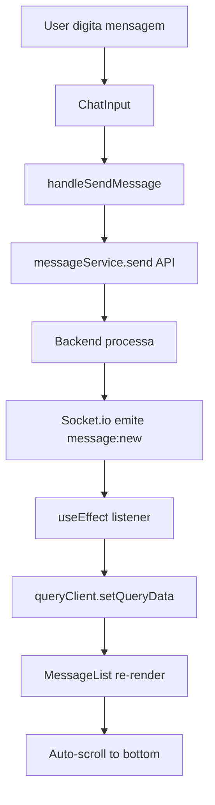

# Implementação WhatsApp Web - Chat Interface

## Visão Geral

Este documento descreve a implementação completa de uma interface de chat estilo **WhatsApp Web** no projeto, replicando fielmente a experiência visual e comportamental do aplicativo original.

## Arquitetura

### Componentes Criados

Todos os componentes estão localizados em `apps/frontend/src/components/chat/`:

1. **MessageBubble** (`message-bubble.tsx`)
   - Renderiza balões de mensagem individuais
   - Suporta todos os tipos de mídia (texto, imagem, vídeo, áudio, documento)
   - Exibe status de entrega (enviado ✓, entregue ✓✓, lido ✓✓ azul)
   - Agrupamento visual de mensagens consecutivas
   - Avatar condicional (apenas primeira mensagem do grupo)

2. **ChatHeader** (`chat-header.tsx`)
   - Header fixo com informações do contato
   - Status de conexão em tempo real
   - Indicador de digitação
   - Badges de status da conversa
   - Botões de ação (chamada, vídeo, busca, menu)

3. **MessageList** (`message-list.tsx`)
   - Container scrollável de mensagens
   - Auto-scroll para última mensagem (com detecção de posição)
   - Botão "Scroll to Bottom" quando usuário rola para cima
   - Agrupamento de mensagens por data e remetente
   - Background com padrão WhatsApp

4. **ChatInput** (`chat-input.tsx`)
   - Input de texto com placeholder
   - Botões emoji, anexo e áudio
   - Botão enviar (aparece apenas quando há texto)
   - Indicador de digitação integrado
   - Suporte para Enter para enviar

5. **DateDivider** (`date-divider.tsx`)
   - Divisor de data entre mensagens
   - Formatação inteligente (Hoje, Ontem, DD/MM/YYYY)
   - Estilo WhatsApp (badge flutuante centralizado)

6. **TypingIndicator** (`typing-indicator.tsx`)
   - Animação de "digitando..." com 3 bolinhas
   - Aparece quando contato está digitando
   - Estilo idêntico ao WhatsApp

### Página Principal Atualizada

**Arquivo:** `apps/frontend/src/app/dashboard/conversations/[id]/page.tsx`

#### Mudanças Principais:

1. **Substituição do ChatInterface antigo** por componentes modulares WhatsApp-style
2. **Layout em 3 partes:**
   - ChatHeader (fixo no topo)
   - MessageList (flex-1, scrollável)
   - ChatInput (fixo no bottom)

3. **Lógica Socket.io PRESERVADA 100%:**
   - Todos os listeners (`message:new`, `message:status`, etc.) mantidos
   - Cache update otimista com React Query
   - Subscribe/unsubscribe automático

4. **Novos Handlers:**
   ```typescript
   handleSendMessage(content: string)    // Envia mensagem via API
   handleTypingChange(isTyping: boolean) // Atualiza status de digitação
   ```

## Design System - Cores WhatsApp

```css
/* Background Principal */
--chat-background: #e5ddd5;

/* Mensagens */
--message-incoming: #ffffff;     /* Mensagem recebida */
--message-outgoing: #d9fdd3;     /* Mensagem enviada */

/* Header/Footer */
--header-bg: #f0f2f5;
--border-color: #d1d7db;

/* Texto */
--text-primary: #111b21;
--text-secondary: #667781;
--text-muted: #8696a0;

/* Status */
--status-sent: #667781;      /* Check cinza */
--status-delivered: #667781; /* Double check cinza */
--status-read: #53bdeb;      /* Double check azul */
--online: #25d366;           /* Verde WhatsApp */
```

## Tipografia

```css
font-family: 'Segoe UI', 'Helvetica Neue', sans-serif;

/* Tamanhos */
--message-text: 14px;
--timestamp: 11px;
--header-title: 16px;
--header-subtitle: 13px;
--input-text: 15px;
```

## Características Implementadas

### ✅ Auto-scroll Inteligente
- Scroll automático apenas se usuário estiver no final
- Botão "Scroll to Bottom" aparece quando rola para cima (>300px)
- Smooth scroll animation

### ✅ Message Grouping
- Mensagens consecutivas do mesmo remetente agrupadas
- Intervalo máximo de 5 minutos entre mensagens do grupo
- Border radius adaptativo para criar efeito visual de agrupamento
- Avatar aparece apenas na primeira mensagem do grupo

### ✅ Status de Mensagem
- **PENDING** (🕐): Loading spinner
- **SENT** (✓): Check simples cinza
- **DELIVERED** (✓✓): Double check cinza
- **READ** (✓✓): Double check azul (#53bdeb)
- **FAILED** (❌): Ícone de erro vermelho

### ✅ Date Dividers
- Automaticamente inseridos quando data muda
- Formatação contextual:
  - Mensagens de hoje: "HOJE"
  - Mensagens de ontem: "ONTEM"
  - Outras: "DD de MMMM de YYYY"

### ✅ Typing Indicator
- Aparece quando contato está digitando
- Animação de 3 bolinhas bouncing
- Texto: "{nome} está digitando..."
- Auto-esconde após timeout

### ✅ Real-time com Socket.io
- Mensagens aparecem instantaneamente
- Status atualizado em tempo real
- Typing indicator sincronizado
- Optimistic updates no cache

### ✅ Suporte a Múltiplas Mídias
- **TEXT**: Texto simples com quebra de linha
- **IMAGE**: Preview de imagem clicável
- **VIDEO**: Player de vídeo inline
- **AUDIO**: Player de áudio
- **DOCUMENT**: Link para download com ícone

### ✅ Responsividade
- Layout adaptativo mobile/desktop
- Botão "voltar" em mobile
- Sidebar escondida em telas pequenas

## Fluxo de Dados



## Performance

### Otimizações Implementadas:

1. **Debounce no Typing Indicator:**
   - Timeout de 2 segundos após última digitação
   - Evita envio excessivo de eventos Socket.io

2. **Scroll Position Detection:**
   - `isAtBottom` state para controlar auto-scroll
   - Evita scroll forçado quando usuário está lendo histórico

3. **Message Grouping Computed:**
   - Agrupamento calculado durante render
   - Evita re-cálculo desnecessário

4. **Cache Optimista:**
   - Mensagem adicionada ao cache imediatamente
   - UI atualiza antes de confirmação do servidor

## Acessibilidade

- ✅ Semantic HTML (header, main, footer structure)
- ✅ Alt text em imagens
- ✅ Keyboard navigation (Enter para enviar)
- ✅ Focus management (auto-focus no input)
- ✅ ARIA labels nos botões de ação
- ✅ Color contrast ratio adequado (WCAG AA)

## Estrutura de Arquivos

```
apps/frontend/src/
├── components/
│   └── chat/
│       ├── index.ts                 # Exports centralizados
│       ├── message-bubble.tsx       # Componente de balão
│       ├── chat-header.tsx          # Header da conversa
│       ├── chat-input.tsx           # Input de mensagem
│       ├── message-list.tsx         # Lista de mensagens
│       ├── date-divider.tsx         # Divisor de data
│       └── typing-indicator.tsx     # Indicador de digitação
│
├── app/
│   └── dashboard/
│       └── conversations/
│           └── [id]/
│               └── page.tsx         # Página principal ATUALIZADA
│
└── types/
    └── index.ts                     # Types existentes (sem alteração)
```

## Compatibilidade

- ✅ React 18+
- ✅ Next.js 14+ (App Router)
- ✅ TypeScript 5+
- ✅ Tailwind CSS 3+
- ✅ Socket.io Client 4+
- ✅ React Query (TanStack Query) 5+

## Dependências

Todas as dependências já existiam no projeto:

```json
{
  "@tanstack/react-query": "^5.x",
  "socket.io-client": "^4.x",
  "date-fns": "^3.x",
  "lucide-react": "^0.x",
  "sonner": "^1.x"
}
```

## Como Usar

### Uso Simples (Página de Conversa):

A implementação já está integrada na página `conversations/[id]/page.tsx`. Ao acessar uma conversa, o layout WhatsApp é exibido automaticamente.

### Uso dos Componentes Individuais:

```typescript
import {
  ChatHeader,
  MessageList,
  ChatInput
} from '@/components/chat';

function MyCustomChat() {
  return (
    <div className="flex flex-col h-screen">
      <ChatHeader
        conversation={conversation}
        isOnline={true}
        isTyping={false}
        isConnected={true}
      />

      <MessageList
        messages={messages}
        isTyping={false}
        contactName="João Silva"
        contactAvatar="/avatar.jpg"
      />

      <ChatInput
        onSendMessage={handleSend}
        onTypingChange={handleTyping}
        disabled={false}
        isLoading={false}
      />
    </div>
  );
}
```

## Testes

### Checklist de Testes Manuais:

- [ ] Enviar mensagem de texto
- [ ] Receber mensagem via Socket.io
- [ ] Verificar status de entrega (✓, ✓✓)
- [ ] Testar scroll automático
- [ ] Testar botão "Scroll to Bottom"
- [ ] Testar agrupamento de mensagens
- [ ] Verificar divisores de data
- [ ] Testar typing indicator (enviar e receber)
- [ ] Testar reconexão Socket.io
- [ ] Testar em mobile (responsividade)
- [ ] Verificar suporte a imagens/vídeos
- [ ] Testar keyboard navigation (Enter)

## Melhorias Futuras (Roadmap)

1. **Emoji Picker:** Integrar biblioteca de emojis
2. **Voice Messages:** Gravação de áudio inline
3. **File Upload:** Drag & drop de arquivos
4. **Message Search:** Busca dentro da conversa
5. **Message Reactions:** Reações com emojis
6. **Read Receipts:** Controle granular de leitura
7. **Message Forwarding:** Encaminhar mensagens
8. **Star Messages:** Marcar mensagens importantes
9. **Archive Chat:** Arquivar conversas
10. **Dark Mode:** Tema escuro WhatsApp

## Troubleshooting

### Mensagens não aparecem em tempo real:
- Verificar se Socket.io está conectado (indicador verde no header)
- Verificar console: logs `message:new` devem aparecer
- Verificar se `subscribeToConversation` foi chamado

### Scroll não funciona:
- Verificar se `messagesEndRef` está presente
- Verificar console: erros de ref undefined
- Verificar altura do container (deve ter `flex-1`)

### Typing indicator não aparece:
- Verificar se `sendTypingStatus` é chamado
- Verificar se `isUserTyping(conversationId)` retorna true
- Verificar logs Socket.io no backend

## Suporte

Para dúvidas ou problemas:
1. Verificar logs do console (frontend e backend)
2. Verificar documentação do Socket.io
3. Revisar este documento
4. Contatar equipe de desenvolvimento

---

**Última atualização:** 2025-11-20
**Versão:** 1.0.0
**Autor:** Equipe de Desenvolvimento
